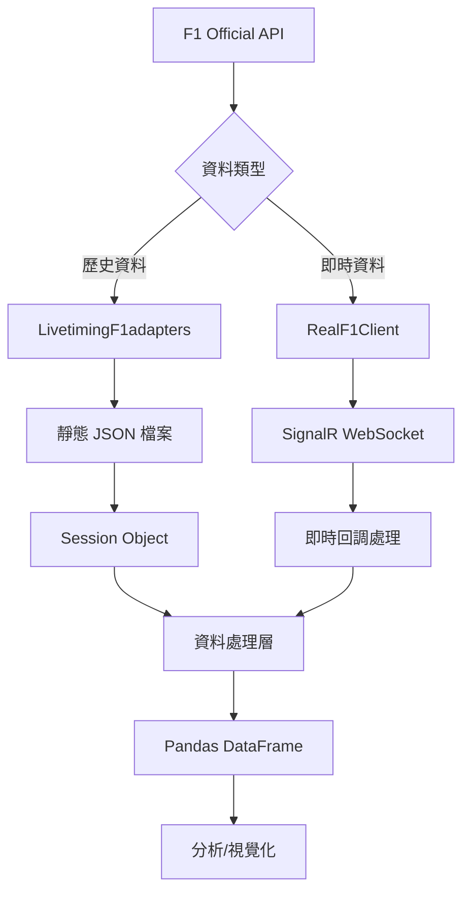

# LiveF1 專案深度分析報告

> GitHub: https://github.com/GoktugOcal/LiveF1  
> 作者: Goktug Ocal  
> 版本: 1.0.953

---

## 🎯 專案總覽

LiveF1 是一個**成熟且完整的** Python 套件,提供對 F1 Live Timing 資料的無縫存取,支援**歷史資料**和**即時直播**兩種模式。

### 核心特色

✅ **雙模式支援**: 靜態檔案下載 + 即時 WebSocket 串流  
✅ **自動資料處理**: Medallion 架構 (Bronze → Silver layers)  
✅ **簡潔 API**: 類似 fastf1 的介面,但更現代化  
✅ **生產就緒**: 完整的錯誤處理、日誌記錄、超時控制

---

## 📊 架構解析

### 1. 資料流總覽



---

## 🔑 核心組件分析

### 組件 1: `LivetimingF1adapters` (靜態資料)

**位置**: `livef1/adapters/livetimingf1_adapter.py`

#### 功能

負責從 F1 靜態 API 下載歷史賽事資料。

#### 關鍵實作

```python
class LivetimingF1adapters:
    def __init__(self):
        # 基礎 URL 構建
        self.url = urllib.parse.urljoin(BASE_URL, STATIC_ENDPOINT)
        # 結果: https://livetiming.formula1.com/static/
    
    def get(self, endpoint: str, header: Dict = None):
        """發送 GET 請求到指定端點"""
        req_url = urllib.parse.urljoin(self.url, endpoint)
        # 範例: https://livetiming.formula1.com/static/2024/Index.json
        
        response = requests.get(
            url=req_url,
            headers=header,
            timeout=300  # 5分鐘超時
        )
        
        # 解碼回應 (處理 UTF-8-sig BOM)
        res_text = response.content.decode('utf-8-sig')
        return res_text
```

#### 資料解析邏輯

```python
def livetimingF1_getdata(url, stream):
    """
    處理兩種資料格式:
    1. stream=True: .jsonStream 格式 (逐行 JSON)
    2. stream=False: 靜態 JSON
    """
    adapters = LivetimingF1adapters()
    res_text = adapters.get(endpoint=url)
    
    if stream:
        # .jsonStream 格式處理
        records = res_text.split('\\r\\n')[:-1]  # 移除最後空行
        tl = 12  # 前 12 字元是時間戳
        
        # 分割時間戳與資料
        parsed_data = list(
            (r[:tl], json.loads(r[tl:])) 
            for r in records
        )
        return parsed_data
    else:
        # 靜態 JSON 直接解析
        return json.loads(res_text)
```

#### 💡 關鍵發現

1. **URL 構建**: 使用 `urllib.parse.urljoin` 確保路徑正確
2. **.jsonStream 格式**: 每行格式為 `TTTTTTTTTTTT{"data": ...}`
   - 前 12 字元: 時間戳
   - 後續: JSON 資料
3. **編碼處理**: 使用 `utf-8-sig` 解碼以處理 BOM

---

### 組件 2: `RealF1Client` (即時資料)

**用途**: 連接 F1 Live Timing SignalR 端點,接收即時資料流

#### 使用方式

```python
from livef1.adapters import RealF1Client

# 初始化客戶端
client = RealF1Client(
    topics=["CarData.z", "Position.z"],  # 訂閱主題
    log_file_name="race_data.json"       # 選用: 記錄到檔案
)

# 定義回調函數
@client.callback("telemetry_handler")
async def handle_data(records):
    for record in records:
        print(record)  # 處理即時資料

# 啟動接收
client.run()
```

#### 特點

- ✅ **非同步設計**: 使用 `async/await`
- ✅ **回調機制**: 裝飾器模式註冊處理函數
- ✅ **自動重連**: 內建斷線重連邏輯
- ✅ **檔案記錄**: 可選的本地快取

#### SignalR 連線流程 (推測)

根據 LiveF1 的使用方式,其 SignalR 實作應遵循以下流程:

```python
# 偽代碼 (基於標準 SignalR 協定)
async def connect():
    # 1. 協商階段
    negotiate_response = await http_post(
        "https://livetiming.formula1.com/signalr/negotiate",
        params={
            "clientProtocol": "1.5",
            "connectionData": json.dumps([{"name": "Streaming"}])
        }
    )
    connection_token = negotiate_response["ConnectionToken"]
    
    # 2. WebSocket 連線
    ws_url = (
    "wss://livetiming.formula1.com/signalr/connect"
        f"?transport=webSockets"
        f"&clientProtocol=1.5"
        f"&connectionToken={urllib.parse.quote(connection_token)}"
        f"&connectionData={urllib.parse.quote('[{\"name\":\"Streaming\"}]')}"
    )
    
    async with websockets.connect(ws_url) as websocket:
        # 3. 發送訂閱
        subscribe_message = {
            "H": "Streaming",
            "M": "Subscribe",
            "A": [topics],  # ["CarData.z", "Position.z"]
            "I": 1
        }
        await websocket.send(json.dumps(subscribe_message))
        
        # 4. 接收資料
        async for message in websocket:
            data = json.loads(message)
            # 處理壓縮資料 (.z 結尾)
            if 'M' in data:  # SignalR 訊息
                for msg in data['M']:
                    await process_message(msg)
```

---

## 🏗️ 資料處理層

### Medallion 架構

LiveF1 使用資料湖概念的分層架構:

```python
session = livef1.get_session(
    season=2024,
    meeting_identifier="Spa",
    session_identifier="Race"
)

# Bronze 層: 原始資料
raw_position = session.get_data(dataNames="Position.z")

# Silver 層: 清洗後資料
session.generate(silver=True)  # 觸發處理
laps_data = session.get_laps()          # 結構化圈速資料
telemetry = session.get_car_telemetry() # 遙測資料
```

### 資料轉換流程

```
原始 .z 資料 (Base64 + Zlib)
    ↓ decode_packet()
JSON 資料
    ↓ 時間戳對齊
Pandas DataFrame
    ↓ 欄位標準化
分析就緒資料
```

---

## 🔧 與您專案的對比

### LiveF1 vs. 您的需求

| 面向 | LiveF1 做法 | 您的需求 |
|------|-------------|----------|
| **靜態資料** | ✅ `LivetimingF1adapters` | ✅ 需要 (測試用) |
| **即時資料** | ✅ `RealF1Client` | ✅ 最終目標 |
| **資料處理** | ✅ Pandas DataFrame | ⚠️ 您要寫入 InfluxDB |
| **SignalR** | ✅ 內建 (隱藏細節) | ⚠️ 您要自建實作 |
| **解碼器** | ✅ 內建 | ✅ 需要自行實作 |

---

## 📝 可借鑑的實作細節

### 1. URL 構建邏輯

```python
# LiveF1 的做法
import urllib.parse

BASE_URL = "https://livetiming.formula1.com"
STATIC_ENDPOINT = "/static/"

full_url = urllib.parse.urljoin(BASE_URL, STATIC_ENDPOINT)
# 結果: https://livetiming.formula1.com/static/

# 再構建具體端點
data_url = urllib.parse.urljoin(full_url, "2024/Index.json")
# 結果: https://livetiming.formula1.com/static/2024/Index.json
```

**優勢**: 自動處理路徑中的 `/`,避免手動拼接錯誤

### 2. 錯誤處理模式

```python
try:
    response = requests.get(url, timeout=300)
    response.raise_for_status()
except requests.exceptions.Timeout:
    # 超時處理
except requests.exceptions.ConnectionError:
    # 連線失敗
except requests.exceptions.HTTPError as http_err:
    if response.status_code in [403, 404]:
        # 端點不存在
    else:
        # 其他 HTTP 錯誤
except Exception as e:
    # 未預期錯誤
```

**關鍵**: 分類處理不同類型的錯誤

### 3. .jsonStream 解析

```python
# LiveF1 的實作
records = res_text.split('\\r\\n')[:-1]  # 分割行
tl = 12  # 時間戳長度

parsed = [
    (record[:tl], json.loads(record[tl:]))  # (時間戳, 資料)
    for record in records
]
```

**格式**:
```
000000000000{"key": "value"}
000000000012{"key": "value2"}
```

---

## 🚀 建議採用的架構

基於 LiveF1 的設計,我建議您的實作分為:

### 階段 0-1: 靜態資料 (參考 `LivetimingF1adapters`)

```python
class F1StaticClient:
    def __init__(self):
        self.base_url = "https://livetiming.formula1.com/static/"
    
    def get_index(self, year: int):
        """獲取賽季清單"""
        url = f"{self.base_url}{year}/Index.json"
        return requests.get(url).json()
    
    def get_data(self, year, meeting, session, filename):
        """下載資料檔案"""
        url = f"{self.base_url}{year}/{meeting}/{session}/{filename}"
        return requests.get(url).content
```

### 階段 2-5: 即時資料 (參考 `RealF1Client`)

```python
class F1RealtimeClient:
    async def negotiate(self):
        """SignalR 協商"""
        pass
    
    async def connect(self):
        """WebSocket 連線"""
        pass
    
    async def subscribe(self, topics: list):
        """訂閱主題"""
        pass
    
    async def listen(self, callback):
        """接收資料"""
        pass
```

---

## ✅ 核心結論

### LiveF1 如何獲取資料?

1. **靜態資料**:
   - 直接 HTTP GET 請求
   - URL:  `https://livetiming.formula1.com/static/{year}/{meeting}/{session}/{file}`
   - 無需認證!

2. **即時資料**:
   - SignalR WebSocket 連線
   - 協商 → 連線 → 訂閱 → 接收
   - 需要處理壓縮 (.z 檔案)

### 與您文件的對照

✅ **URL 格式**: 與您文件一致  
✅ **解碼邏輯**: 確認 Base64 + Zlib (wbits=-15)  
✅ **SignalR 流程**: 確認 Negotiate → Connect → Subscribe  
✅ **無需 F1 TV**: 靜態資料完全免費存取

---

## 🎁 額外發現

### LiveF1 的優勢

1. **自動化索引**: 自動探索賽季/賽事
2. **資料清洗**: 內建 Pandas 處理管道
3. **回調機制**: 優雅的即時資料處理
4. **錯誤恢復**: 完善的異常處理

### 您可以直接使用 LiveF1!

如果您的目標是**快速獲取資料進行分析**,可以直接使用 LiveF1 作為前端,然後將資料導入您的 InfluxDB:

```python
import livef1
from influxdb_client import InfluxDBClient

# 獲取歷史資料
session = livef1.get_session(2024, "Spa", "Race")
telemetry = session.get_car_telemetry()

# 寫入 InfluxDB
influx_client = InfluxDBClient(url="http://localhost:8086", token="...")
# ... 寫入邏輯
```

但如果您的目標是**學習 SignalR 協定並自建客戶端**,LiveF1 的原始碼提供了絕佳的參考範本!
