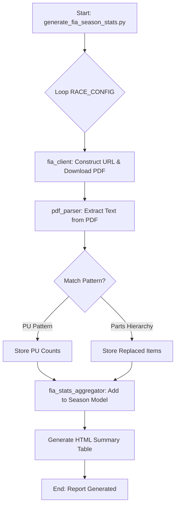

# FIA 2025 賽季部件更換分析系統 (FIA 2025 Season Component Analysis System)

本文件說明了用於追蹤與分析 2025 F1 賽季 FIA 技術代表報告 (Technical Delegate Reports) 的自動化系統邏輯、實現細節與驗證方法。

## 1. 系統目標
- **自動化抓取**：從 FIA 官網獲取全賽季的動力單元 (PU) 使用狀況與賽車部件更換紀錄。
- **數據結構化**：將非結構化的 PDF 報告轉換為可分析的 JSON 數據與可視化的 HTML 表格。
- **賽季追蹤**：橫向對比全賽季 24 場比賽中，每位車手的部件更換歷史。

---

## 2. 核心邏輯與架構

系統分為三個主要模組，遵循單一職責原則：

### 2.1 文件抓取 (Scraping & Implementation) - `fia_client.py`
由於 FIA 官網的 Document 頁面通常只顯示「最新」一站的資訊，本系統採用 **啟發式路徑預測 (Heuristic Path Prediction)**：
- **路徑規律**：發現 FIA PDF 存儲於 `/system/files/decision-document/` 下，命名格式固定為 `{年份}_{賽站名}_grand_prix_-_{類別}.pdf`。
- **容錯處理**：使用 `requests` 配合 `User-Agent` 模擬瀏覽器，並透過 `HEAD` 請求預先驗證文件是否存在，避免大量的 404 錯誤。

### 2.2 數據解析 (PDF Parsing) - `pdf_parser.py`
由於 2025 年的文件格式存在跳變（有些是純 Table，有些是純文字排版），系統採用了 **雙模態解析邏輯**：
- **動力單元解析 (PU Elements)**：
    - 使用 `Regex` 匹配模式：`^(\d{1,2})\s+.+?\s+(\d+)\s+(\d+)\s+(\d+)\s+(\d+)\s+(\d+)\s+(\d+)\s+(\d+)`。
    - 邏輯：從文字流中過濾出以「車號」開頭，後跟 7 個連續數字的行，分別對應 `ICE`, `TC`, `MGU-H`, `MGU-K`, `ES`, `CE`, `EX`。
- **部件更換解析 (Parts & Parameters)**：
    - **層次解析法**：先識別車隊標題（以 `:` 結尾），再識別車號（如 `Car 81:`），最後抓取其下方的縮排項目。
    - **動作過濾**：自動排除「Parameter changes associated...」等無關說明，僅保留實體部件名稱。

### 2.3 數據聚合 (Aggregation) - `fia_stats_aggregator.py`
- **時序對齊**：內建 `RACE_CONFIG` 定義了 24 站的官方順序與日期，確保表格從左到右按時間排列。
- **後設數據與視覺化**：整合了 `DRIVER_META` 表，將車號歸一化（如 `01` -> `1`），自動匹配車隊縮寫、代表色與 CSS 樣式。

---

## 3. 演算與處理流程 (Algorithms)



---

## 4. 驗證方法 (Verification)

為了確保數據的準確性，我們執行了以下驗證步驟：
1.  **交叉核對 (Cross-Referencing)**：將解析出的阿布達比 (Abu Dhabi) 數據與官網原本的 PDF 內容進行人工抽檢，確認 Piastri (#81) 與 Norris (#04) 的 PU 數值完全一致。
2.  **異常處理測試**：針對新加入的車手 (如 #05 Bortoleto, #06 Hadjar)，系統需正確處理補零 (`05`) 與非補零 (`5`) 的對應，確保不會出現 `Unknown` 車隊。
3.  **邊界值檢查**：驗證當某場比賽沒有文件（如賽季尚未開始或文件尚未發布）時，系統能顯示 `-` 或 `not found` 而不會崩潰。

---

## 5. 如何運行

1.  **環境需求**：`python 3.9+`, `pdfplumber`, `BeautifulSoup4`。
2.  **執行流程**：
    ```bash
    # 執行全賽季數據獲取與分析
    python generate_fia_season_stats.py
    ```
3.  **產出物**：
    - `fia_stats_2025.json`: 原始結構化數據。
    - `fia_season_stats_2025_[PID].html`: 格式化網頁報告。

---

## 6. 維護建議
如果賽季中 FIA 更改了文件名命名慣例（例如將 `_-_` 改為 `_`），只需在 `generate_fia_season_stats.py` 的 `BASE_PDF_URL` 模板處修改即可。
