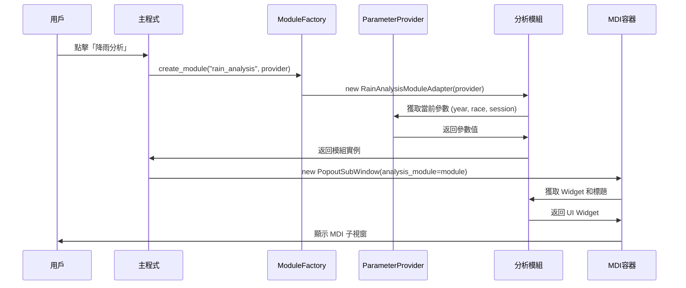
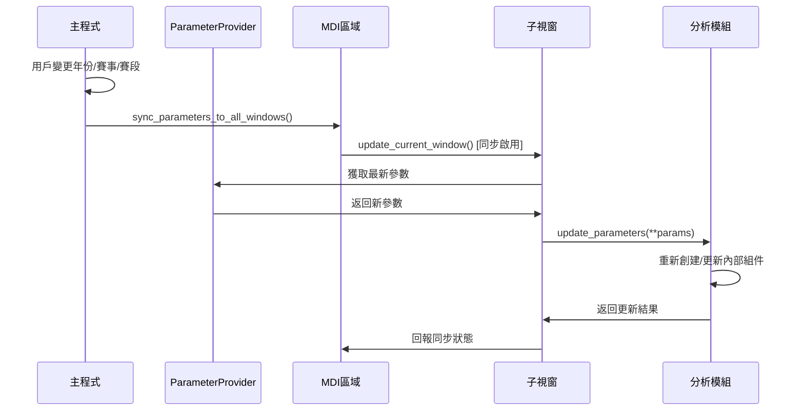
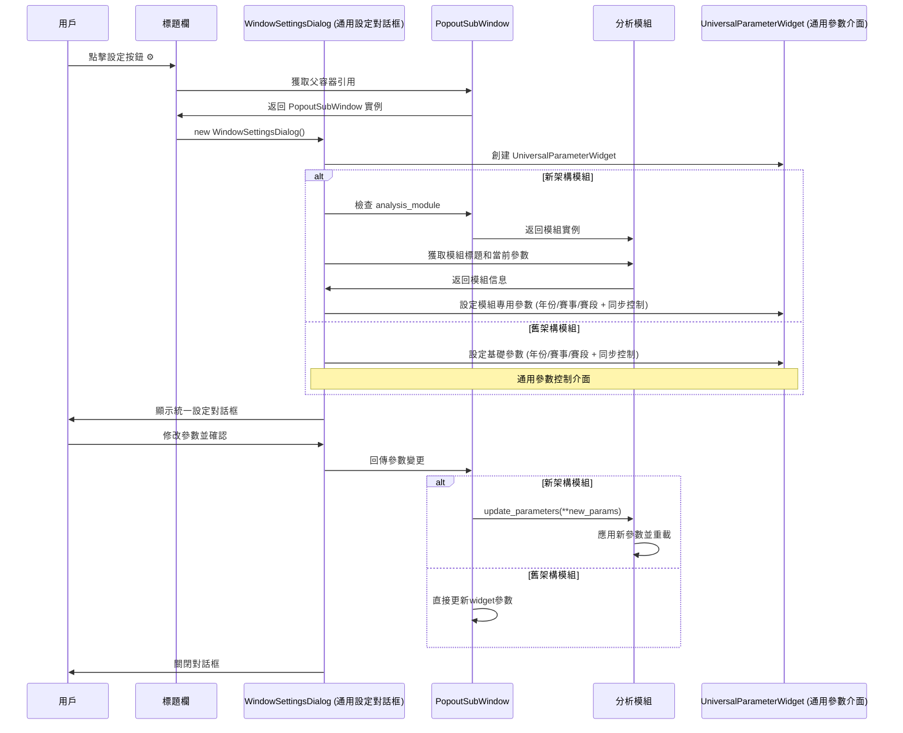

# F1T MDI 子模組新架構文檔

## 📋 概述

本文檔詳細說明 F1 Telemetry Professional (F1T) 系統中 MDI (Multiple Document Interface) 子模組的全新模組化架構。新架構採用 **組合模式 + 介面抽象** 設計，實現了統一的模組管理、參數同步和可擴展性。

---

## 🏗️ 架構總覽

### 核心設計原則

1. **容器與內容分離**：MDI 容器負責視窗管理，分析模組負責業務邏輯
2. **介面抽象**：所有分析模組實現統一的 `IAnalysisModule` 介面
3. **工廠模式**：通過 `ModuleFactory` 統一創建和管理模組實例
4. **參數提供者模式**：主程式參數通過 `IParameterProvider` 介面傳遞
5. **信號驅動**：模組間通信採用 Qt 信號槽機制

### 架構層次圖

```
┌─────────────────────────────────────────────────────────────┐
│                    主程式 (StyleHMainWindow)                    │
│  ┌─────────────────┐  ┌─────────────────────────────────────┐ │
│  │  UI 控制元件      │  │     MainWindowParameterProvider     │ │
│  │ (年份/賽事/賽段)  │  │        (參數提供者實現)              │ │
│  └─────────────────┘  └─────────────────────────────────────┘ │
└─────────────────────────────────────────────────────────────┘
                              │
                              ▼
┌─────────────────────────────────────────────────────────────┐
│                   CustomMdiArea (MDI 管理區域)                │
│  ┌─────────────────────────────────────────────────────────┐ │
│  │              PopoutSubWindow (MDI 容器)                 │ │
│  │  ┌─────────────────┐  ┌─────────────────────────────────┐ │ │
│  │  │  DraggableTitleBar │  │     分析模組適配器               │ │ │
│  │  │  ┌──────────────┐ │  │  ┌─────────────────────────────┐ │ │ │
│  │  │  │ 同步勾選框    │ │  │  │    IAnalysisModule 實現     │ │ │ │
│  │  │  │ 設定按鈕     │ │  │  │                             │ │ │ │
│  │  │  │ 視窗控制     │ │  │  │  ┌─────────────────────────┐ │ │ │ │
│  │  │  └──────────────┘ │  │  │  │    實際分析 Widget       │ │ │ │ │
│  │  └─────────────────┘  │  │  │  │ (RainAnalysisModule)    │ │ │ │ │
│  │                       │  │  │  └─────────────────────────┘ │ │ │ │
│  │                       │  │  └─────────────────────────────┘ │ │ │
│  │                       │  └─────────────────────────────────┘ │ │
│  └─────────────────────────────────────────────────────────┘ │
└─────────────────────────────────────────────────────────────┘
                              │
                              ▼
┌─────────────────────────────────────────────────────────────┐
│                    ModuleFactory (模組工廠)                    │
│  ┌─────────────────┐  ┌─────────────────┐  ┌─────────────────┐ │
│  │ 降雨分析模組     │  │ 遙測分析模組     │  │ 統計分析模組     │ │
│  │ (RAIN_ANALYSIS) │  │ (TELEMETRY_*)   │  │ (STATISTICS)    │ │
│  └─────────────────┘  └─────────────────┘  └─────────────────┘ │
└─────────────────────────────────────────────────────────────┘
```

---

## 🔧 核心組件詳解

### 1. 介面抽象層 (`base_analysis_module.py`)

#### IAnalysisModule 介面
```python
class IAnalysisModule(ABC):
    """分析模組標準介面"""
    
    @abstractmethod
    def get_widget(self) -> QWidget:
        """返回模組的主要UI Widget"""
    
    @abstractmethod
    def get_title(self) -> str:
        """返回模組標題"""
    
    @abstractmethod
    def update_parameters(self, **params) -> bool:
        """更新分析參數"""
    
    @abstractmethod
    def supports_sync(self) -> bool:
        """是否支援主程式同步"""
    
    @abstractmethod
    def get_parameter_interface(self) -> Optional[QWidget]:
        """返回參數設定介面（用於設定對話框）"""
    
    @abstractmethod
    def get_default_size(self) -> tuple:
        """返回預設視窗大小 (width, height)"""
    
    @abstractmethod
    def cleanup(self):
        """清理資源"""
```

#### IParameterProvider 介面
```python
class IParameterProvider(ABC):
    """參數提供者介面 - 用於從主程式獲取參數"""
    
    @abstractmethod
    def get_current_year(self) -> str:
        """獲取當前年份"""
    
    @abstractmethod  
    def get_current_race(self) -> str:
        """獲取當前賽事"""
    
    @abstractmethod
    def get_current_session(self) -> str:
        """獲取當前賽段"""
```

### 2. 模組工廠 (`ModuleFactory`)

#### 功能特性
- **註冊機制**：`register_module(module_type, module_class)`
- **創建管理**：`create_module(module_type, parameter_provider, **kwargs)`
- **類型檢查**：`module_exists(module_type)`
- **模組列表**：`get_available_modules()`

#### 模組類型定義
```python
class ModuleTypes:
    RAIN_ANALYSIS = "rain_analysis"
    TELEMETRY_SPEED = "telemetry_speed"  
    TELEMETRY_BRAKE = "telemetry_brake"
    TELEMETRY_THROTTLE = "telemetry_throttle"
    TELEMETRY_STEERING = "telemetry_steering"
    STATISTICS = "statistics"
    TRACK_MAP = "track_map"
    LAP_ANALYSIS = "lap_analysis"
```

### 3. 基礎模組實現 (`BaseAnalysisModule`)

提供 `IAnalysisModule` 的基礎實現，包含：
- **信號系統**：`ModuleSignals` 用於模組間通信
- **參數管理**：統一的參數更新和獲取機制
- **同步支援**：預設支援主程式參數同步
- **資源清理**：標準的清理邏輯

---

## 📊 信息流分析

### 1. 模組創建流程



### 2. 參數同步流程



### 3. 通用設定對話框流程



---

## 🔄 雙軌架構支援

### 新舊架構兼容性

系統採用 **雙軌架構** 設計，同時支援新模組化架構和舊版 Widget 模式：

```python
def create_analysis_window(self, function_name):
    """創建分析視窗 - 支援新舊雙軌架構"""
    
    # 🆕 優先嘗試新架構
    module = self._create_analysis_module(function_name)
    if module:
        # 新架構路徑
        sub_window = PopoutSubWindow(analysis_module=module)
        widget = module.get_widget()
        title = module.get_title()
    else:
        # 🔄 降級到舊架構  
        sub_window = PopoutSubWindow()
        widget = self._create_legacy_content(function_name)
        title = f"{function_name} - 分析"
    
    sub_window.setWidget(widget)
    return sub_window
```

### 遷移狀態

| 模組類型 | 新架構狀態 | 介面實現 | 工廠註冊 |
|---------|-----------|---------|---------|
| 降雨分析 | ✅ 已遷移 | `RainAnalysisModuleAdapter` | ✅ 已註冊 |
| 遙測分析 | ✅ 已遷移 | `TelemetryModule` | ✅ 已註冊 |
| 統計分析 | ✅ 已遷移 | `StatisticsModule` | ✅ 已註冊 |
| 其他模組 | ⚠️ 待遷移 | 使用舊版 Widget | ❌ 未註冊 |

---

## 🎛️ 用戶介面集成

### 1. 自訂標題欄 (`DraggableTitleBar`)

**功能特性**：
- **🔗 同步勾選框**：接收主程式參數 (紅/綠狀態指示)
- **⚙️ 設定按鈕**：開啟模組專用設定對話框  
- **🔄 視窗控制**：最小化、關閉、彈出功能
- **🖱️ 拖曳支援**：標題欄拖曳移動視窗

**狀態指示**：
```css
/* 同步按鈕狀態 */
#SyncButton {
    background-color: #FF4444;  /* 紅色 - 獨立模式 */
}
#SyncButton:checked {
    background-color: #00CC00;  /* 綠色 - 接收同步 */
}
```

### 2. MDI 容器 (`PopoutSubWindow`)

**雙模式支援**：
- **新架構模式**：接收 `analysis_module` 參數，委託模組處理
- **舊架構模式**：直接設定 Widget，保持向後相容性

**初始化流程**：
```python
def __init__(self, title="", parent_mdi=None, analysis_module=None):
    # 基礎屬性初始化
    self.analysis_module = analysis_module
    self._parameter_provider = None
    
    # 尋找主視窗並建立參數提供者
    if parent_mdi:
        main_window = self._find_main_window(parent_mdi)
        if main_window:
            self._parameter_provider = MainWindowParameterProvider(main_window)
    
    # 連接模組信號
    if self.analysis_module and self._parameter_provider:
        self.analysis_module.parameter_provider = self._parameter_provider
        self._connect_module_signals()
```

---

## 📱 具體實現案例

### 通用設定對話框系統

#### WindowSettingsDialog (通用設定對話框)
```python
class WindowSettingsDialog(QDialog):
    """通用設定對話框 - 適用於所有MDI子視窗"""
    
    def __init__(self, parent_window=None):
        super().__init__()
        self.parent_window = parent_window  # PopoutSubWindow 實例
        self.init_ui()
    
    def init_ui(self):
        """初始化通用設定界面"""
        # 創建通用參數介面
        self.param_widget = UniversalParameterWidget(self.parent_window)
        
        # 設定對話框布局
        layout = QVBoxLayout(self)
        layout.addWidget(self.param_widget)
        
        # 標準按鈕
        button_layout = QHBoxLayout()
        self.ok_button = QPushButton("OK")
        self.cancel_button = QPushButton("Cancel")
        button_layout.addWidget(self.ok_button)
        button_layout.addWidget(self.cancel_button)
        layout.addLayout(button_layout)
```

#### UniversalParameterWidget (通用參數介面)
```python
class UniversalParameterWidget(QWidget):
    """通用參數設定介面 - 適用於所有分析模組"""
    
    def __init__(self, parent_window=None):
        super().__init__()
        self.parent_window = parent_window  # PopoutSubWindow 實例
        self.init_ui()
        self.load_current_parameters()
    
    def init_ui(self):
        """初始化通用參數設定界面"""
        layout = QVBoxLayout(self)
        
        # 模組標題顯示
        self.module_title_label = QLabel("[TOOL] 模組設定")
        layout.addWidget(self.module_title_label)
        
        # 同步控制區域
        sync_group = QGroupBox("同步控制")
        sync_layout = QVBoxLayout(sync_group)
        
        self.sync_checkbox = QCheckBox("接收主程式同步 (年份/賽事/賽段)")
        sync_layout.addWidget(self.sync_checkbox)
        layout.addWidget(sync_group)
        
        # 分析參數區域
        param_group = QGroupBox("分析參數")
        param_layout = QGridLayout(param_group)
        
        # 年份設定
        param_layout.addWidget(QLabel("年份:"), 0, 0)
        self.year_combo = QComboBox()
        self.year_combo.addItems(["2018", "2019", "2020", "2021", "2022", "2023", "2024", "2025"])
        param_layout.addWidget(self.year_combo, 0, 1)
        
        # 賽事設定
        param_layout.addWidget(QLabel("賽事:"), 1, 0)
        self.race_combo = QComboBox()
        self.race_combo.addItems([
            "Australia", "Bahrain", "China", "Japan", "Miami", "Emilia Romagna",
            "Monaco", "Canada", "Spain", "Austria", "Great Britain", "Hungary",
            "Belgium", "Netherlands", "Italy", "Azerbaijan", "Singapore",
            "United States", "Mexico", "Brazil", "Las Vegas", "Qatar", "Abu Dhabi"
        ])
        param_layout.addWidget(self.race_combo, 1, 1)
        
        # 賽段設定
        param_layout.addWidget(QLabel("賽段:"), 2, 0)
        self.session_combo = QComboBox()
        self.session_combo.addItems(["FP1", "FP2", "FP3", "Q", "R"])
        param_layout.addWidget(self.session_combo, 2, 1)
        
        layout.addWidget(param_group)
    
    def load_current_parameters(self):
        """載入當前參數到介面"""
        if self.parent_window:
            # 檢查是否為新架構模組
            if hasattr(self.parent_window, 'analysis_module') and self.parent_window.analysis_module:
                # 新架構：從模組獲取參數
                module = self.parent_window.analysis_module
                self.module_title_label.setText(f"[TOOL] {module.get_title()}設定")
                
                # 從參數提供者獲取當前參數
                if hasattr(module, 'parameter_provider') and module.parameter_provider:
                    provider = module.parameter_provider
                    self.year_combo.setCurrentText(provider.get_current_year())
                    self.race_combo.setCurrentText(provider.get_current_race())
                    self.session_combo.setCurrentText(provider.get_current_session())
            else:
                # 舊架構：使用預設參數
                self.module_title_label.setText("[TOOL] 分析模組設定")
                self.year_combo.setCurrentText("2025")
                self.race_combo.setCurrentText("Japan")
                self.session_combo.setCurrentText("R")
            
            # 載入同步狀態
            if hasattr(self.parent_window, 'sync_enabled'):
                self.sync_checkbox.setChecked(self.parent_window.sync_enabled)
```

### 降雨分析模組遷移

#### 原始實現 (舊架構)
```python
class RainAnalysisModule(QWidget):
    """直接繼承 QWidget，獨立實現"""
    def __init__(self, year=2025, race="Japan", session="R", parent=None):
        super().__init__(parent)
        # 直接處理所有邏輯...
```

#### 新架構適配器
```python
class RainAnalysisModuleAdapter(BaseAnalysisModule):
    """降雨分析模組適配器 - 新架構實現"""
    
    def __init__(self, parameter_provider: IParameterProvider = None, **kwargs):
        super().__init__("降雨分析", parameter_provider)
        
        # 創建包裝的原始模組
        self._rain_module = RainAnalysisModule(
            year=self.year, race=self.race, session=self.session
        )
    
    def get_widget(self) -> QWidget:
        return self._rain_module
    
    def update_parameters(self, **params) -> bool:
        # 重新創建模組以反映新參數
        if self._rain_module:
            self._rain_module.deleteLater()
        self._rain_module = RainAnalysisModule(**params)
        return True
    
    def get_parameter_interface(self) -> QWidget:
        """返回None，使用通用設定介面"""
        return None  # 使用 UniversalParameterWidget
```

#### 工廠註冊
```python
# 在模組底部自動註冊
ModuleFactory.register_module(ModuleTypes.RAIN_ANALYSIS, RainAnalysisModuleAdapter)
```

---

## ⚙️ 配置和擴展

### 新增分析模組

1. **實現介面**：
   ```python
   class MyAnalysisModule(BaseAnalysisModule):
       def __init__(self, parameter_provider=None):
           super().__init__("我的分析", parameter_provider)
       
       def get_widget(self) -> QWidget:
           return MyAnalysisWidget()
       
       # 實現其他必要方法...
   ```

2. **註冊模組**：
   ```python
   ModuleFactory.register_module("my_analysis", MyAnalysisModule)
   ```

3. **更新映射**：
   ```python
   # 在 f1t_gui_main.py 中更新模組映射
   module_mapping = {
       "我的分析": "my_analysis",
       # 其他映射...
   }
   ```

### 參數介面客製化

#### 通用參數介面 (推薦使用)
```python
class UniversalParameterWidget(QWidget):
    """通用參數設定介面 - 適用於所有分析模組"""
    
    def get_parameters(self) -> dict:
        """返回當前參數設定"""
        return {
            'year': int(self.year_combo.currentText()),
            'race': self.race_combo.currentText(),
            'session': self.session_combo.currentText(),
            'sync_enabled': self.sync_checkbox.isChecked()
        }
    
    def set_parameters(self, params: dict):
        """設定參數值"""
        if 'year' in params:
            self.year_combo.setCurrentText(str(params['year']))
        if 'race' in params:
            self.race_combo.setCurrentText(params['race'])
        if 'session' in params:
            self.session_combo.setCurrentText(params['session'])
        if 'sync_enabled' in params:
            self.sync_checkbox.setChecked(params['sync_enabled'])
```

#### 客製化參數介面 (特殊需求)
```python
class CustomParameterWidget(QWidget):
    """客製化參數設定介面 - 用於特殊模組需求"""
    
    def __init__(self, parent_window=None):
        super().__init__()
        self.parent_window = parent_window
        self.init_custom_ui()
    
    def init_custom_ui(self):
        """初始化客製化參數界面"""
        # 基礎參數 (繼承通用介面)
        self.universal_widget = UniversalParameterWidget(self.parent_window)
        
        # 客製化參數
        layout = QVBoxLayout(self)
        layout.addWidget(self.universal_widget)
        
        # 添加模組專用參數
        custom_group = QGroupBox("進階設定")
        custom_layout = QVBoxLayout(custom_group)
        
        self.advanced_option = QCheckBox("啟用進階分析")
        custom_layout.addWidget(self.advanced_option)
        
        layout.addWidget(custom_group)
```

---

## 🔧 除錯和監控

### 日誌系統

系統提供詳細的日誌輸出用於除錯：

```
✅ [MODULE_FACTORY] 成功創建模組: rain_analysis (降雨分析)
🔗 [INIT] 降雨分析 - 2025 Japan (R) 已找到主視窗引用
✅ [INIT] PopoutSubWindow '降雨分析 - 2025 Japan (R)' 初始化完成
✅ [MODULE] 使用模組化架構創建視窗: 降雨分析 - 2025 Japan (R)
🔄 [SYNC] 開始同步 race = Australia 到所有MDI子視窗
✅ [SYNC] 完成同步，共更新 1 個子視窗
```

### 錯誤處理

```python
def _create_analysis_module(self, function_name):
    try:
        module = ModuleFactory.create_module(module_type, parameter_provider)
        if module:
            print(f"✅ [MODULE_FACTORY] 成功創建模組: {module_type}")
            return module
        else:
            print(f"❌ [MODULE_FACTORY] 模組創建失敗: {module_type}")
    except Exception as e:
        print(f"❌ [MODULE_FACTORY] 模組創建異常: {e}")
    return None
```

---

## 🚀 未來發展

### 規劃功能

1. **動態模組載入**：支援從外部檔案載入模組
2. **模組熱重載**：開發時支援模組熱更新
3. **配置持久化**：保存模組設定到檔案
4. **模組市場**：支援第三方模組安裝
5. **效能監控**：模組效能指標收集

### 架構優化

1. **記憶體管理**：改善模組實例的生命週期管理
2. **並行處理**：支援模組背景計算
3. **事件系統**：更強大的模組間通信機制
4. **測試框架**：完整的模組單元測試支援

## 🎯 **結論**

**設定視窗採用通用架構設計**，所有 MDI 子模組共享相同的設定對話框架構：

### 🏗️ **通用設定系統架構**

1. **WindowSettingsDialog** - 通用設定對話框容器
2. **UniversalParameterWidget** - 通用參數設定介面  
3. **動態內容載入** - 根據模組類型動態調整標題和參數
4. **統一用戶體驗** - 所有模組使用相同的設定界面樣式

### 📊 **設定視窗組件對應表**

| 用戶看到的界面元素 | 對應的通用架構組件 |
|------------------|-------------------|
| 📋 視窗標題 "視窗設定" | `WindowSettingsDialog` |
| 🏷️ "[TOOL] 降雨分析設定" | `UniversalParameterWidget.module_title_label` |
| ☑️ "接收主程式同步" | `UniversalParameterWidget.sync_checkbox` |
| 🔢 年份 "2025" | `UniversalParameterWidget.year_combo` |
| 🏁 賽事 "Japan" | `UniversalParameterWidget.race_combo` |
| 🎯 賽段 "R" | `UniversalParameterWidget.session_combo` |
| 🔘 "OK"/"Cancel" 按鈕 | `WindowSettingsDialog` 標準按鈕 |

這完美展示了新架構的模組化設計：**通用設定對話框可以適用於所有分析模組**，而無需為每個模組單獨開發設定界面，同時保持了統一的用戶體驗！

---

## 📚 參考資料

### 核心檔案

- `modules/gui/base_analysis_module.py` - 介面定義和工廠實現
- `modules/gui/telemetry_modules.py` - 遙測模組實現範例
- `modules/gui/rain_analysis_module.py` - 降雨分析模組適配器
- `f1t_gui_main.py` - 主程式集成邏輯

### 相關文檔

- Qt MDI 文檔：[QMdiArea](https://doc.qt.io/qt-5/qmdiarea.html)
- Python ABC 模組：[Abstract Base Classes](https://docs.python.org/3/library/abc.html)
- 設計模式：Factory Pattern, Adapter Pattern, Observer Pattern

---

**文檔版本**：1.0  
**最後更新**：2025年8月28日  
**維護者**：F1T 開發團隊
