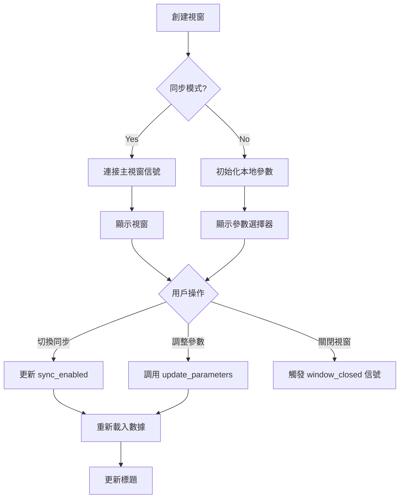

# 🪟 MDI 視窗 Windows 設定深度解析

> **文件版本**: v1.0.0 (2025-10-20)  
> **適用版本**: F1T GUI unification-phase0  
> **作者**: GitHub Copilot AI Assistant

---

## 📋 目錄

1. [MDI 架構概述](#-mdi-架構概述)
2. [PopoutSubWindow 核心類別](#-popoutsubwindow-核心類別)
3. [CustomMdiArea 自定義容器](#-custommdiarea-自定義容器)
4. [視窗設定選項](#-視窗設定選項)
5. [視窗狀態管理](#-視窗狀態管理)
6. [調整大小機制](#-調整大小機制)
7. [快照與還原](#-快照與還原)
8. [最佳實踐建議](#-最佳實踐建議)

---

## 🏗️ MDI 架構概述

### 系統架構圖

```
F1TelemetryStation (主視窗)
    ├── CustomMdiArea (MDI 容器)
    │   ├── PopoutSubWindow #1 (子視窗)
    │   │   ├── CustomTitleBar (自定義標題欄)
    │   │   ├── Analysis Module (分析模組)
    │   │   └── Content Widget (內容區)
    │   ├── PopoutSubWindow #2
    │   └── PopoutSubWindow #N
    └── Global Signal Manager (全域信號管理)
```

### 核心組件關係

| 組件 | 位置 | 功能 |
|-----|------|-----|
| `CustomMdiArea` | Line 117-267 | MDI 容器，管理所有子視窗 |
| `PopoutSubWindow` | Line 2292-2692+ | 子視窗類別，支援彈出與調整大小 |
| `CustomTitleBar` | Line ~1900+ | 自定義標題欄（包含同步按鈕、設定等） |
| `IAnalysisModule` | 各模組目錄 | 分析模組接口 |

---

## 🔧 PopoutSubWindow 核心類別

### 類別定義

**檔案位置**: `f1t_gui_main.py:2292-2692`

```python
class PopoutSubWindow(QMdiSubWindow):
    """支援彈出功能和調整大小的MDI子視窗 - 升級為通用模組容器"""
    
    # 自定義信號
    resized = pyqtSignal()         # 尺寸調整信號
    window_closed = pyqtSignal()   # 視窗關閉信號
```

### 初始化參數

```python
def __init__(
    self, 
    title="",                      # 視窗標題
    parent_mdi=None,               # 父 MDI 容器
    analysis_module=None,          # 分析模組實例
    sync_enabled=True,             # 是否啟用同步
    parameter_provider=None,       # 參數提供者
    global_signal_manager=None,    # 全域信號管理器
    **kwargs                       # 其他關鍵字參數
)
```

### 關鍵屬性

#### 1. 視窗狀態屬性

```python
# 彈出狀態
self.is_popped_out = False           # 是否已彈出為獨立視窗

# 最小化狀態
self.is_minimized = False            # 是否最小化
self.original_geometry = None        # 最小化前的原始幾何位置

# 同步狀態
self.sync_enabled = True             # 是否與主視窗同步參數
```

#### 2. 參數管理屬性

```python
# 本地參數存儲（用於非同步模式）
self.local_year = "2025"
self.local_race = "Japan"
self.local_session = "R"

# 參數查找映射
self._season_event_lookup: Dict[str, SeasonEvent] = {}
self._display_to_race_key: Dict[str, str] = {}
```

#### 3. 調整大小屬性

```python
# 調整大小參數
self.resize_margin = 3                    # 視覺邊框寬度 (3px)
self.resize_detection_margin = 10         # 可操作區域 (10px)
self.resizing = False                     # 是否正在調整大小
self.resize_direction = None              # 調整方向
```

#### 4. 模組整合屬性

```python
# 分析模組
self.analysis_module = analysis_module    # 分析模組實例
self._parameter_provider = None           # 參數提供者

# 主視窗引用
self.main_window = None                   # 主視窗引用

# 模組名稱
self.module_name = "..."                  # 從標題提取的模組名稱
```

### 核心方法清單

#### 視窗狀態管理

| 方法 | 功能 | 返回值 |
|-----|------|-------|
| `update_current_window()` | 更新視窗數據 | `bool` |
| `update_window_title()` | 更新視窗標題 | `None` |
| `toggle_x_sync(enabled)` | 切換同步狀態 | `bool` |
| `update_local_parameters()` | 更新本地參數 | `None` |

#### 參數獲取

| 方法 | 功能 | 返回值 |
|-----|------|-------|
| `get_current_parameters()` | 獲取當前參數 | `Dict[str, Any]` |
| `get_selected_event()` | 獲取當前賽事 | `Optional[SeasonEvent]` |
| `get_selected_race_key()` | 獲取賽事 Key | `str` |
| `get_selected_session_code()` | 獲取會話代碼 | `str` |

#### 調整大小 (進階功能)

| 方法 | 功能 | 說明 |
|-----|------|-----|
| `mousePressEvent()` | 滑鼠按下事件 | 檢測調整大小操作 |
| `mouseMoveEvent()` | 滑鼠移動事件 | 執行調整大小 |
| `mouseReleaseEvent()` | 滑鼠釋放事件 | 完成調整大小 |

---

## 📦 CustomMdiArea 自定義容器

### 類別定義

**檔案位置**: `f1t_gui_main.py:117-267`

```python
class CustomMdiArea(QMdiArea):
    """自定義MDI區域，強制執行子視窗最小尺寸限制"""
```

### 核心配置

#### 1. 視窗模式設定

```python
def __init__(self, parent=None):
    super().__init__(parent)
    
    # 激活順序
    self.setActivationOrder(QMdiArea.CreationOrder)
    
    # 視圖模式
    self.setViewMode(QMdiArea.SubWindowView)
    
    # 右鍵選單
    self.setContextMenuPolicy(Qt.NoContextMenu)
    
    # 最大化選項
    self.setOption(QMdiArea.DontMaximizeSubWindowOnActivation, True)
```

#### 2. 子視窗樣式設定

```python
def addSubWindow(self, widget, flags=None):
    """添加子視窗並設定樣式"""
    
    # 創建子視窗
    if flags is not None:
        subwindow = super().addSubWindow(widget, flags)
    else:
        subwindow = super().addSubWindow(widget)
    
    # 應用 CSS 樣式
    if subwindow:
        subwindow.setStyleSheet("""
            QMdiSubWindow::title {
                height: 0px;          /* 隱藏標題列 */
                margin: 0px;
                padding: 0px;
                background: transparent;
                border: none;
            }
            QMdiSubWindow {
                border: 2px solid #666666;   /* 邊框 */
                border-radius: 2px;          /* 圓角 */
                background-color: #FFFFFF;   /* 背景色 */
            }
        """)
```

### 固定視窗排列

#### 三欄佈局系統

```python
def _rearrange_fixed_windows(self):
    """重新排列固定的歡迎頁面視窗（三欄排列）"""
    
    # 計算寬度
    left_width = mdi_width // 3        # 33%
    middle_width = mdi_width // 3      # 33%
    right_width = mdi_width - left_width - middle_width  # 34%
    
    # 左欄高度分割
    left_top_height = int(mdi_height * 0.45)      # 45%
    left_bottom_height = mdi_height - left_top_height  # 55%
```

#### 視窗定位屬性

```python
# 歡迎頁面視窗標記
sw.setProperty("is_welcome_fixed", True)
sw.setProperty("welcome_position", "left_top")  # 或 left_bottom, middle, right
```

---

## ⚙️ 視窗設定選項

### Qt 視窗標誌 (Window Flags)

#### 常用標誌組合

```python
# 1. 無邊框視窗（已棄用）
# ❌ 舊版做法（已移除）
# subwindow.setWindowFlags(subwindow.windowFlags() | Qt.FramelessWindowHint)

# 2. 保留邊框但隱藏標題列（當前做法）
# ✅ 使用 CSS 樣式（Line 224-244）
subwindow.setStyleSheet("""...""")

# 3. 可調整大小
self.setMouseTracking(True)
self.setAttribute(Qt.WA_Hover, True)
self.setAttribute(Qt.WA_MouseTracking, True)
```

#### 視窗屬性 (Attributes)

```python
# 關閉時刪除資源
self.setAttribute(Qt.WA_DeleteOnClose, True)

# 滑鼠追蹤
self.setAttribute(Qt.WA_Hover, True)
self.setAttribute(Qt.WA_MouseTracking, True)
```

### 視窗幾何設定

#### 尺寸設定

```python
# 方法 1: 使用 resize()
sub_window.resize(800, 600)

# 方法 2: 使用 setGeometry()
sub_window.setGeometry(x, y, width, height)

# 方法 3: 從模組獲取預設尺寸
if hasattr(module, "get_default_size"):
    width, height = module.get_default_size()
    sub_window.resize(width, height)
```

#### 位置設定

```python
# 方法 1: 使用 move()
sub_window.move(100, 50)

# 方法 2: 使用 setGeometry()
sub_window.setGeometry(100, 50, 800, 600)

# 方法 3: 自動定位（避免重疊）
self._position_subwindow(mdi_area, sub_window)
```

---

## 📊 視窗狀態管理

### 同步模式 vs 非同步模式

#### 同步模式 (Sync Enabled)

```python
# 啟用同步
sub_window.sync_enabled = True

# 參數來源：主視窗
params = {
    'year': self._parameter_provider.get_current_year(),
    'race': self._parameter_provider.get_current_race(),
    'session': self._parameter_provider.get_current_session()
}

# 視窗標題格式
# "Rain Analysis - 2025 Singapore R"
```

**行為特徵**:
- ✅ 主視窗參數變更時，視窗自動更新
- ✅ 標題欄同步按鈕為「開啟」狀態
- ✅ 使用 `parameter_provider` 獲取參數

#### 非同步模式 (Sync Disabled)

```python
# 禁用同步
sub_window.sync_enabled = False

# 參數來源：本地存儲
params = {
    'year': int(sub_window.local_year),
    'race': sub_window.local_race,
    'session': sub_window.local_session
}

# 獨立參數選擇器
# 標題欄顯示下拉式選單
```

**行為特徵**:
- ✅ 不受主視窗影響，獨立運作
- ✅ 標題欄同步按鈕為「關閉」狀態
- ✅ 使用 `local_year`, `local_race`, `local_session` 存儲參數

### 視窗狀態轉換



---

## 🔍 調整大小機制

### 可調整大小區域

```
┌─────────────────────────────┐
│  ↖ 左上角 (10px x 10px)     │  ← 上邊緣 (10px)
│                             │
│                             │
│   ← 左邊緣 (10px)            │  → 右邊緣 (10px)
│                             │
│                             │
│  ↙ 左下角 (10px x 10px)     │  ← 下邊緣 (10px)
└─────────────────────────────┘
```

### 調整方向檢測

```python
def _get_resize_direction(self, pos):
    """檢測滑鼠位置對應的調整方向"""
    margin = self.resize_detection_margin  # 10px
    width = self.width()
    height = self.height()
    
    # 角落優先（10px x 10px）
    if pos.x() <= margin and pos.y() <= margin:
        return "top_left"
    if pos.x() >= width - margin and pos.y() <= margin:
        return "top_right"
    if pos.x() <= margin and pos.y() >= height - margin:
        return "bottom_left"
    if pos.x() >= width - margin and pos.y() >= height - margin:
        return "bottom_right"
    
    # 邊緣（10px）
    if pos.x() <= margin:
        return "left"
    if pos.x() >= width - margin:
        return "right"
    if pos.y() <= margin:
        return "top"
    if pos.y() >= height - margin:
        return "bottom"
    
    return None
```

### 游標形狀映射

| 方向 | 游標類型 | Qt 常量 |
|-----|---------|---------|
| `top_left` / `bottom_right` | ↖↘ | `Qt.SizeFDiagCursor` |
| `top_right` / `bottom_left` | ↗↙ | `Qt.SizeBDiagCursor` |
| `left` / `right` | ↔ | `Qt.SizeHorCursor` |
| `top` / `bottom` | ↕ | `Qt.SizeVerCursor` |
| `None` | → | `Qt.ArrowCursor` |

### 調整大小流程

```python
# 1. 滑鼠按下 (mousePressEvent)
def mousePressEvent(self, event):
    if event.button() == Qt.LeftButton:
        direction = self._get_resize_direction(event.pos())
        if direction:
            self.resizing = True
            self.resize_direction = direction
            self.resize_start_pos = event.globalPos()
            self.resize_start_geometry = self.geometry()

# 2. 滑鼠移動 (mouseMoveEvent)
def mouseMoveEvent(self, event):
    if self.resizing:
        # 計算位移
        delta = event.globalPos() - self.resize_start_pos
        
        # 根據方向調整幾何
        if "right" in self.resize_direction:
            new_width = max(100, self.resize_start_geometry.width() + delta.x())
        if "bottom" in self.resize_direction:
            new_height = max(100, self.resize_start_geometry.height() + delta.y())
        # ... 其他方向處理

# 3. 滑鼠釋放 (mouseReleaseEvent)
def mouseReleaseEvent(self, event):
    if event.button() == Qt.LeftButton and self.resizing:
        self.resizing = False
        self.resize_direction = None
        self.resized.emit()  # 發送調整大小信號
```

---

## 💾 快照與還原

### 快照系統架構

**主要方法**: `f1t_gui_main.py:12870-12975`

```python
# 1. 收集所有視窗狀態
def _collect_open_windows_state(self) -> List[Dict[str, Any]]:
    """產生所有開啟視窗的快照資料"""
    open_windows = []
    for subwindow in getattr(self, "active_subwindows", []) or []:
        if not isinstance(subwindow, PopoutSubWindow):
            continue
        state = self._collect_subwindow_state(subwindow)
        if state:
            open_windows.append(state)
    return open_windows
```

### 視窗狀態結構

```json
{
  "title": "Rain Analysis - 2025 Singapore R",
  "mdi_area": "main_mdi_area",
  "geometry": {
    "x": 100,
    "y": 50,
    "width": 800,
    "height": 600
  },
  "window_state": "normal",  // 或 "minimized", "maximized"
  "sync_enabled": true,
  "local_parameters": {
    "year": "2025",
    "race": "Singapore",
    "session": "R"
  },
  "module": {
    "module_path": "modules.gui.rain_analysis.rain_analysis_module",
    "class_name": "RainAnalysisModuleAdapter",
    "factory_type": "rain_analysis",
    "parameters": { /* 模組特定參數 */ }
  }
}
```

### 還原流程

```python
# 1. 還原所有視窗
def _restore_windows_from_state(self, windows_state: List[Dict[str, Any]]):
    """根據快照重建所有視窗"""
    for window_state in windows_state:
        try:
            self._restore_single_window(window_state)
        except Exception as exc:
            logger.exception("Failed to restore window state", exc_info=exc)

# 2. 還原單一視窗
def _restore_single_window(self, window_state: Dict[str, Any]):
    """根據快照資訊重建單一分析視窗"""
    
    # 步驟 1: 重建模組實例
    module_state = window_state.get("module")
    analysis_module = self._instantiate_module_from_state(module_state)
    
    # 步驟 2: 找到對應的 MDI 區域
    mdi_area = self._find_mdi_area_by_name(window_state.get("mdi_area"))
    
    # 步驟 3: 創建子視窗
    sub_window = PopoutSubWindow(
        title=window_state.get("title"),
        parent_mdi=mdi_area,
        analysis_module=analysis_module
    )
    
    # 步驟 4: 還原幾何位置
    geometry = window_state.get("geometry", {})
    sub_window.resize(geometry.get("width"), geometry.get("height"))
    
    # 步驟 5: 還原同步狀態
    sync_enabled = window_state.get("sync_enabled", True)
    sub_window.toggle_x_sync(enabled=sync_enabled)
    
    # 步驟 6: 還原本地參數
    local_params = window_state.get("local_parameters", {})
    sub_window.local_year = str(local_params.get("year"))
    sub_window.local_race = local_params.get("race")
    sub_window.local_session = local_params.get("session")
    
    # 步驟 7: 顯示視窗
    sub_window.show()
```

---

## 🎯 最佳實踐建議

### 1. 視窗創建標準流程

```python
def _create_analysis_window(self, mdi_area, module_class, **params):
    """標準化的視窗創建流程"""
    
    # 步驟 1: 創建分析模組實例
    analysis_module = module_class(parent=self.main_window)
    
    # 步驟 2: 設置參數提供者
    if hasattr(analysis_module, 'parameter_provider'):
        analysis_module.parameter_provider = MainWindowParameterProvider(self)
    
    # 步驟 3: 初始化模組
    if hasattr(analysis_module, 'initialize_module'):
        analysis_module.initialize_module(**params)
    
    # 步驟 4: 獲取視窗標題
    window_title = analysis_module.get_window_title(
        params['year'], params['race'], params['session']
    )
    
    # 步驟 5: 創建 PopoutSubWindow
    sub_window = PopoutSubWindow(
        window_title, 
        mdi_area, 
        analysis_module,
        sync_enabled=True,
        parameter_provider=MainWindowParameterProvider(self)
    )
    
    # 步驟 6: 設置內容 Widget
    sub_window.setWidget(analysis_module.get_widget())
    
    # 步驟 7: 設置父視窗引用
    if hasattr(analysis_module, "set_parent_window"):
        analysis_module.set_parent_window(sub_window)
    
    # 步驟 8: 設置視窗尺寸
    if hasattr(analysis_module, "get_default_size"):
        width, height = analysis_module.get_default_size()
        sub_window.resize(width, height)
    
    # 步驟 9: 加入 MDI 並註冊
    mdi_area.addSubWindow(sub_window)
    
    if hasattr(sub_window, 'window_closed'):
        sub_window.window_closed.connect(
            partial(self.on_subwindow_closed, sub_window)
        )
    
    if hasattr(self, 'active_subwindows'):
        self.active_subwindows.append(sub_window)
    
    # 步驟 10: 顯示並載入數據
    sub_window.show()
    self._position_subwindow(mdi_area, sub_window)
    
    if hasattr(analysis_module, 'load_data'):
        analysis_module.load_data()
    
    return sub_window
```

### 2. 參數同步最佳實踐

```python
# ✅ 正確：使用參數提供者
class MyAnalysisModule(IAnalysisModule):
    def __init__(self, parent=None):
        super().__init__(parent)
        self.parameter_provider = None  # 由 PopoutSubWindow 注入
    
    def update_parameters(self, year, race, session):
        """參數更新時自動調用"""
        self.current_year = year
        self.current_race = race
        self.current_session = session
        self.reload_data()

# ❌ 錯誤：直接訪問主視窗
class BadAnalysisModule(IAnalysisModule):
    def update_parameters(self, year, race, session):
        # 不要這樣做！
        main_window = self.parent().parent().parent()  # 脆弱的層級依賴
        year = main_window.year_combo.currentText()    # 直接耦合
```

### 3. 視窗清理最佳實踐

```python
# ✅ 正確：完整清理流程
def on_subwindow_closed(self, sub_window):
    """視窗關閉時的清理流程"""
    
    # 步驟 1: 從活動列表移除
    if hasattr(self, 'active_subwindows') and sub_window in self.active_subwindows:
        self.active_subwindows.remove(sub_window)
    
    # 步驟 2: 斷開信號連接
    if hasattr(sub_window, 'window_closed'):
        try:
            sub_window.window_closed.disconnect()
        except Exception as e:
            print(f"[WARNING] 斷開信號失敗: {e}")
    
    # 步驟 3: 清理模組資源
    if hasattr(sub_window, 'analysis_module') and sub_window.analysis_module:
        if hasattr(sub_window.analysis_module, 'cleanup'):
            sub_window.analysis_module.cleanup()
    
    # 步驟 4: 強制刪除
    sub_window.deleteLater()
    
    print(f"[CLEANUP] 視窗已清理: {sub_window.windowTitle()}")
```

### 4. 多開視窗支援

```python
# ✅ 2025-10-20 更新：允許多開視窗

# 舊版（已禁用）：檢查重複視窗
"""
expected_title_patterns = self._get_expected_window_title_pattern(...)
existing_window = self._find_existing_window(mdi_area, expected_title_patterns)
if existing_window:
    # 聚焦現有視窗，不創建新視窗
    return
"""

# 新版：允許創建多個相同類型的視窗
logger.info(f"[MULTI_WINDOW] ✅ 允許創建多個視窗: {function_name}")
# 直接創建視窗，不檢查重複
self._create_analysis_window(mdi_area, module_class, **params)
```

### 5. 調整大小最佳實踐

```python
# ✅ 正確：啟用調整大小支援
class MyAnalysisModule(IAnalysisModule):
    def __init__(self, parent=None):
        super().__init__(parent)
        
        # 確保滑鼠追蹤已啟用
        self.setMouseTracking(True)
        self.setAttribute(Qt.WA_Hover, True)
        self.setAttribute(Qt.WA_MouseTracking, True)
    
    def get_default_size(self):
        """返回預設視窗尺寸"""
        return (800, 600)  # (width, height)

# ❌ 錯誤：固定尺寸限制
class BadAnalysisModule(IAnalysisModule):
    def __init__(self, parent=None):
        super().__init__(parent)
        
        # 不要設置固定尺寸！
        self.setFixedSize(800, 600)  # 會阻止調整大小
```

---

## 🔗 相關文件

- [F1T 開發原則](../DEVELOPMENT_PRINCIPLES.md)
- [GUI 模組開發指南](../GUI_MODULE_DEVELOPMENT.md)
- [API-ONLY 模式政策](../API_ONLY_MODE_POLICY.md)
- [快照系統詳解](../SNAPSHOT_SYSTEM_GUIDE.md)

---

## 📝 變更日誌

### v1.0.0 (2025-10-20)
- ✅ 初始版本
- ✅ 完整記錄 `PopoutSubWindow` 類別
- ✅ 完整記錄 `CustomMdiArea` 類別
- ✅ 調整大小機制詳解
- ✅ 快照與還原系統
- ✅ 多開視窗支援說明

---

**文件結束** | 如有問題，請參考 `.github/copilot-instructions.md`
