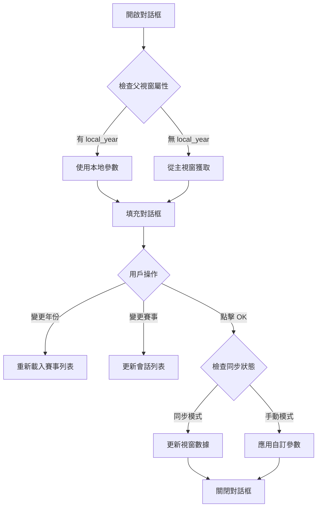

# ⚙️ MDI 視窗設定對話框完整指南

> **文件版本**: v1.0.0 (2025-10-20)  
> **適用版本**: F1T GUI unification-phase0  
> **作者**: GitHub Copilot AI Assistant

---

## 📋 目錄

1. [對話框概述](#-對話框概述)
2. [啟動方式](#-啟動方式)
3. [對話框結構](#-對話框結構)
4. [功能詳解](#-功能詳解)
5. [同步模式 vs 手動模式](#-同步模式-vs-手動模式)
6. [代碼實現](#-代碼實現)
7. [最佳實踐](#-最佳實踐)
8. [常見問題](#-常見問題)

---

## 🎯 對話框概述

### 什麼是 Window Settings？

**Window Settings Dialog** 是每個 MDI 子視窗的設定對話框，允許用戶：
- ✅ 切換**同步模式**（接收主視窗參數）vs **手動模式**（獨立設定）
- ✅ 在手動模式下自訂分析參數（年份、賽事、會話）
- ✅ 即時預覽和應用參數變更

### 關鍵特性

| 特性 | 說明 |
|-----|------|
| **模態對話框** | 阻塞父視窗，強制用戶確認或取消 |
| **即時鎖定** | 同步模式啟用時自動鎖定參數編輯 |
| **動態賽事列表** | 根據選擇的年份動態載入該年度賽事 |
| **參數驗證** | 確保參數有效性（例如：會話代碼匹配） |

---

## 🚀 啟動方式

### 方法 1: 標題欄設定按鈕

每個 MDI 子視窗的自定義標題欄都有一個 **⚙** 設定按鈕：

```
┌─────────────────────────────────────────────┐
│ 🔗 [視窗標題] ─ □ ⚙ ─ □ ⧉ ✕                │  ← 標題欄
│                                             │
│   [分析內容區域]                              │
│                                             │
└─────────────────────────────────────────────┘
              ↑
            設定按鈕（點擊開啟對話框）
```

**實現位置**: `f1t_gui_main.py:2027-2031`

```python
# 設定按鈕（放在最小化按鈕左邊）
settings_btn = QPushButton("⚙")
settings_btn.setObjectName("SettingsButton")
settings_btn.setFixedSize(16, 16)
settings_btn.setToolTip("視窗設定")
settings_btn.clicked.connect(self.parent_window.show_settings_dialog)
```

### 方法 2: 程式化調用

```python
# 在 PopoutSubWindow 實例中
sub_window.show_settings_dialog()
```

**實現位置**: `f1t_gui_main.py:4382-4385`

```python
def show_settings_dialog(self):
    """顯示設定對話框"""
    dialog = WindowSettingsDialog(self)
    dialog.exec_()
```

---

## 🏗️ 對話框結構

### 視覺佈局

```
┌─────────────────────────────────────────┐
│ Window Settings                    [✕]  │  ← 對話框標題
├─────────────────────────────────────────┤
│ [TOOL] 視窗分析設定                      │  ← 標題 Label
│                                         │
│ ┌─ 視窗同步控制 ─────────────────────┐  │
│ │ ☑ [LINK] Receive Main Window     │  │  ← 同步勾選框
│ │    Sync (Year/Race/Session)       │  │
│ └────────────────────────────────────┘  │
│                                         │
│ ┌─ 分析參數 ─────────────────────────┐  │
│ │ 年份:  [2025 ▼]                   │  │  ← 年份選擇器
│ │ 賽事:  [Singapore ▼]              │  │  ← 賽事選擇器
│ │ 賽段:  [R ▼]                      │  │  ← 會話選擇器
│ └────────────────────────────────────┘  │
│                                         │
│                                         │
│           [  OK  ]  [ Cancel ]          │  ← 確認/取消按鈕
└─────────────────────────────────────────┘
```

### 組件層次

```python
WindowSettingsDialog (QDialog)
├── QVBoxLayout (主佈局)
│   ├── QLabel (標題: "[TOOL] 視窗分析設定")
│   ├── QGroupBox (視窗同步控制)
│   │   └── QCheckBox (self.sync_windows_checkbox)
│   ├── QGroupBox (分析參數)
│   │   ├── QLabel ("年份:") + QComboBox (self.year_combo)
│   │   ├── QLabel ("賽事:") + QComboBox (self.race_combo)
│   │   └── QLabel ("賽段:") + QComboBox (self.session_combo)
│   ├── QStretch (彈性空間)
│   └── QDialogButtonBox (OK + Cancel)
```

---

## 🔧 功能詳解

### 1. 同步控制勾選框

**位置**: `f1t_gui_main.py:5208-5217`

```python
self.sync_windows_checkbox = QCheckBox(
    tr("sync_checkbox_main", "[LINK] Receive Main Window Sync (Year/Race/Session)")
)
self.sync_windows_checkbox.setObjectName("SyncWindowsCheckbox")

# 從父視窗獲取當前同步狀態
current_sync_state = getattr(parent_window, 'sync_enabled', True)
self.sync_windows_checkbox.setChecked(current_sync_state)

# 當同步狀態改變時，切換分析參數的可編輯性
self.sync_windows_checkbox.toggled.connect(self.on_sync_checkbox_toggled)
```

**功能**:
- ✅ **勾選時**: 啟用同步模式，接收主視窗參數變更
- ❌ **取消勾選時**: 啟用手動模式，允許獨立設定參數

### 2. 年份選擇器

**位置**: `f1t_gui_main.py:5226-5236`

```python
self.year_combo = QComboBox()
self.year_combo.setObjectName("AnalysisComboBox")
self.year_combo.addItems([str(year) for year in range(2020, 2026)])

# 優先從子視窗本地參數獲取，其次從主視窗獲取
if hasattr(parent_window, 'local_year') and parent_window.local_year:
    current_year = parent_window.local_year
else:
    current_year = self.get_current_year_from_main_window()
self.year_combo.setCurrentText(current_year)

# 年份變更時動態更新賽事列表
self.year_combo.currentTextChanged.connect(self.on_year_changed_in_dialog)
```

**支援年份**: 2020-2025（共 6 年）

### 3. 賽事選擇器

**位置**: `f1t_gui_main.py:5238-5250`

```python
self.race_combo = QComboBox()
self.race_combo.setObjectName("AnalysisComboBox")

# 使用動態賽事列表而非硬編碼
self.populate_races_for_year(current_year)

# 優先從子視窗本地參數獲取
if hasattr(parent_window, 'local_race') and parent_window.local_race:
    current_race = parent_window.local_race
else:
    current_race = self.get_current_race_from_main_window()
self._select_race_by_key(current_race)

self.race_combo.currentIndexChanged.connect(self._on_race_combo_changed)
```

**動態載入**: 根據選擇的年份自動更新賽事列表

### 4. 會話選擇器

**位置**: `f1t_gui_main.py:5252-5263`

```python
self.session_combo = QComboBox()
self.session_combo.setObjectName("AnalysisComboBox")

# 優先從子視窗本地參數獲取
if hasattr(parent_window, 'local_session') and parent_window.local_session:
    current_session = parent_window.local_session
else:
    current_session = self.get_current_session_from_main_window()

self._update_session_combo(preserve_session_code=current_session)
```

**支援會話**: FP1, FP2, FP3, SQ, Q, R（根據賽事動態調整）

---

## 🔄 同步模式 vs 手動模式

### 同步模式 (Sync Enabled)

**啟用條件**: `sync_windows_checkbox.isChecked() == True`

#### 行為特徵

| 特性 | 行為 |
|-----|------|
| **參數來源** | 接收主視窗參數（`parameter_provider`） |
| **參數編輯** | ❌ 禁用（Year/Race/Session 下拉式選單鎖定） |
| **視窗標題** | 自動同步更新 |
| **數據更新** | 主視窗變更時自動重新載入 |
| **提示訊息** | "已啟用同步接收，參數由主程式控制" |

#### 視覺狀態

```
┌─ 分析參數 ─────────────────────────┐
│ 年份:  [2025 ▼] 🔒 (灰色，不可編輯) │
│ 賽事:  [Singapore ▼] 🔒            │
│ 賽段:  [R ▼] 🔒                   │
└────────────────────────────────────┘
```

#### 實現代碼

**位置**: `f1t_gui_main.py:5311-5332`

```python
def update_analysis_params_editability(self):
    """根據同步狀態更新分析參數的可編輯性"""
    is_sync_enabled = self.sync_windows_checkbox.isChecked()
    
    # 設置分析參數控件的可編輯性（同步時不可編輯）
    self.year_combo.setEnabled(not is_sync_enabled)
    self.race_combo.setEnabled(not is_sync_enabled)
    self.session_combo.setEnabled(not is_sync_enabled)
    
    # 更新提示文字
    if is_sync_enabled:
        self.year_combo.setToolTip("已啟用同步接收，參數由主程式控制")
        self.race_combo.setToolTip("已啟用同步接收，參數由主程式控制")
        self.session_combo.setToolTip("已啟用同步接收，參數由主程式控制")
        print(f"[LOCK] [SETTING] 分析參數已鎖定 - 接收主程式同步")
    else:
        self.year_combo.setToolTip(tr("year_tooltip", "Set year manually"))
        self.race_combo.setToolTip(tr("race_tooltip", "Set race manually"))
        self.session_combo.setToolTip(tr("session_tooltip", "Set session manually"))
        print(f"🔓 [SETTING] 分析參數已解鎖 - 可手動編輯")
```

### 手動模式 (Manual Mode)

**啟用條件**: `sync_windows_checkbox.isChecked() == False`

#### 行為特徵

| 特性 | 行為 |
|-----|------|
| **參數來源** | 使用本地參數（`local_year`, `local_race`, `local_session`） |
| **參數編輯** | ✅ 啟用（可自由選擇 Year/Race/Session） |
| **視窗標題** | 手動更新（基於本地參數） |
| **數據更新** | 僅在點擊 OK 時更新 |
| **提示訊息** | "Set year/race/session manually" |

#### 視覺狀態

```
┌─ 分析參數 ─────────────────────────┐
│ 年份:  [2024 ▼] ✅ (藍色，可編輯)   │
│ 賽事:  [Japan ▼] ✅               │
│ 賽段:  [Q ▼] ✅                   │
└────────────────────────────────────┘
```

#### 實現代碼

**位置**: `f1t_gui_main.py:5618-5631`

```python
def apply_manual_settings(self, year, race, session):
    """應用手動設定（獨立模式）"""
    window_title = self.parent_window.windowTitle()
    print(f"[TOOL] [SETTING] [{window_title}] 應用手動設定: {year} {race} {session}")
    
    try:
        # 更新當前視窗的內容（使用手動設定的參數）
        self.update_current_window_with_params(year, race, session)
        print(f"[OK] [SETTING] 手動設定應用完成")
    except Exception as e:
        print(f"[ERROR] [SETTING] 應用手動設定失敗: {e}")
```

---

## 💻 代碼實現

### 完整類別定義

**檔案位置**: `f1t_gui_main.py:5181-5684`

```python
class WindowSettingsDialog(QDialog):
    """視窗設定對話框"""
    
    def __init__(self, parent_window):
        super().__init__()
        self.parent_window = parent_window
        self.main_window = parent_window.main_window if hasattr(parent_window, 'main_window') else parent_window
        self._season_event_lookup: Dict[str, SeasonEvent] = {}
        self._display_to_race_key: Dict[str, str] = {}
        
        self.setWindowTitle("Window Settings")
        self.setObjectName("SettingsDialog")
        self.setFixedSize(400, 300)
        self.setModal(True)
        
        # ... (完整實現見原始碼)
```

### 關鍵方法列表

| 方法名稱 | 功能 | 返回值 |
|---------|------|-------|
| `__init__(parent_window)` | 初始化對話框 | `None` |
| `on_sync_checkbox_toggled(checked)` | 處理同步勾選框變更 | `None` |
| `update_analysis_params_editability()` | 更新參數可編輯性 | `None` |
| `accept_settings()` | 確認並應用設定 | `None` |
| `update_current_window_only()` | 更新視窗（同步模式） | `None` |
| `apply_manual_settings(year, race, session)` | 應用手動設定 | `None` |
| `populate_races_for_year(year)` | 載入指定年份賽事列表 | `None` |
| `get_current_year_from_main_window()` | 獲取主視窗年份 | `str` |
| `get_current_race_from_main_window()` | 獲取主視窗賽事 | `str` |
| `get_current_session_from_main_window()` | 獲取主視窗會話 | `str` |

### 參數應用流程

**位置**: `f1t_gui_main.py:5584-5611`

```python
def accept_settings(self):
    """確認設定"""
    window_title = self.parent_window.windowTitle()
    year = self.year_combo.currentText()
    race = self.get_selected_race_key()
    session = self.get_selected_session_code()
    sync_windows = self.sync_windows_checkbox.isChecked()
    
    print(f"[TOOL] [SETTING] [{window_title}] 設定已更新:")
    print(f"   參數: {year} {race} {session}")
    print(f"   同步接收狀態: {'啟用' if sync_windows else '停用'}")
    
    # 保存同步狀態到父視窗
    self.parent_window.sync_enabled = sync_windows
    
    # 根據同步狀態決定行為
    if sync_windows:
        # 當啟用同步時，只接收不發送，確保與主程式一致
        print(f"[REFRESH] [SETTING] [{window_title}] 同步接收模式 - 僅更新當前視窗")
        self.update_current_window_only()
    else:
        # 當停用同步時，允許手動設定並應用到當前視窗
        print(f"[TOOL] [SETTING] [{window_title}] 手動設定模式 - 應用自定義參數")
        self.apply_manual_settings(year, race, session)
    
    self.accept()
```

### 參數獲取邏輯



---

## 🎯 最佳實踐

### 1. 初始化對話框時的參數優先級

```python
# ✅ 正確：優先使用子視窗本地參數
if hasattr(parent_window, 'local_year') and parent_window.local_year:
    current_year = parent_window.local_year
else:
    current_year = self.get_current_year_from_main_window()

# ❌ 錯誤：直接使用主視窗參數（忽略本地設定）
current_year = self.main_window.year_combo.currentText()
```

### 2. 動態賽事列表更新

```python
# ✅ 正確：年份變更時重新載入賽事
self.year_combo.currentTextChanged.connect(self.on_year_changed_in_dialog)

def on_year_changed_in_dialog(self, year_text):
    """年份變更時更新賽事列表"""
    self.populate_races_for_year(year_text)

# ❌ 錯誤：使用靜態賽事列表
self.race_combo.addItems(["Japan", "Singapore", "Italy"])  # 不考慮年份差異
```

### 3. 同步狀態變更處理

```python
# ✅ 正確：立即更新 UI 可編輯性
self.sync_windows_checkbox.toggled.connect(self.on_sync_checkbox_toggled)

def on_sync_checkbox_toggled(self, checked):
    print(f"[LINK] [SETTING] 同步接收狀態變更為: {'啟用' if checked else '停用'}")
    self.update_analysis_params_editability()  # 立即鎖定/解鎖控件

# ❌ 錯誤：等到點擊 OK 才更新
# (用戶無法即時看到鎖定效果)
```

### 4. 避免命令混亂

```python
# ✅ 正確：子視窗只接收，不發送控制命令
if sync_windows:
    self.update_current_window_only()  # 僅更新當前視窗
else:
    self.apply_manual_settings(year, race, session)  # 應用本地設定

# ❌ 錯誤：子視窗向主視窗發送參數變更
def sync_to_other_windows(self, year, race, session):
    # 這會導致多視窗命令混亂！
    self.main_window.year_combo.setCurrentText(year)  # 不要這樣做！
```

### 5. 安全的主視窗參數獲取

```python
# ✅ 正確：多層防護，避免 AttributeError
def get_current_year_from_main_window(self):
    try:
        if hasattr(self.parent_window, 'main_window'):
            main_window = self.parent_window.main_window
            if hasattr(main_window, 'year_combo') and main_window.year_combo:
                return main_window.year_combo.currentText()
    except Exception as e:
        print(f"[WARNING] [SETTING] 獲取年份失敗: {e}")
    return "2025"  # 預設值

# ❌ 錯誤：假設層級結構存在
def get_current_year_from_main_window(self):
    return self.parent_window.main_window.year_combo.currentText()  # 可能崩潰！
```

---

## ❓ 常見問題

### Q1: 為什麼同步模式下參數選擇器變灰了？

**答**: 這是設計行為。當啟用同步模式時，參數由主視窗控制，子視窗只接收不發送。因此參數選擇器被鎖定，防止用戶誤以為可以獨立設定參數。

### Q2: 如何在手動模式下設定參數？

**步驟**:
1. 取消勾選「[LINK] Receive Main Window Sync」
2. 參數選擇器自動解鎖（變藍色）
3. 選擇所需的 Year/Race/Session
4. 點擊 OK 應用變更

### Q3: 對話框中的參數變更會影響其他視窗嗎？

**答**: **不會**（2025-10-20 更新）。對話框設計為「單視窗設定」，避免命令混亂：
- 同步模式：只接收主視窗參數
- 手動模式：只更新當前視窗

### Q4: 如何確認當前是否處於同步模式？

**方法**:
1. **視覺檢查**: 參數選擇器是否灰色（鎖定）
2. **標題欄**: 查看同步按鈕（🔗）是否高亮
3. **Log 輸出**: 查找 `[LOCK] [SETTING] 分析參數已鎖定` 訊息

### Q5: 對話框大小可以調整嗎？

**答**: **不可以**。對話框大小固定為 400x300 像素（`setFixedSize(400, 300)`），確保所有控件正確顯示。

### Q6: 年份列表為什麼只有 2020-2025？

**答**: 這是硬編碼範圍（`range(2020, 2026)`）。如果需要支援更多年份，可修改：

```python
# 當前實現
self.year_combo.addItems([str(year) for year in range(2020, 2026)])

# 動態範圍建議
current_year = datetime.now().year
self.year_combo.addItems([str(year) for year in range(2018, current_year + 2)])
```

### Q7: 如何調試對話框行為？

**啟用調試輸出**:
```python
# 對話框初始化時會輸出
print(f"[TOOL] [SETTING] 視窗分析設定對話框已開啟")

# 同步狀態變更時
print(f"[LINK] [SETTING] 同步接收狀態變更為: {'啟用' if checked else '停用'}")

# 參數應用時
print(f"[TOOL] [SETTING] [{window_title}] 設定已更新:")
print(f"   參數: {year} {race} {session}")
```

---

## 🔗 相關文件

- [MDI 視窗設定深度解析](./MDI_WINDOW_SETTINGS_DEEP_DIVE.md) - 完整的 MDI 架構文件
- [PopoutSubWindow 類別](./MDI_WINDOW_SETTINGS_DEEP_DIVE.md#-popoutsubwindow-核心類別) - 父視窗類別詳解
- [參數同步機制](./MDI_WINDOW_SETTINGS_DEEP_DIVE.md#-視窗狀態管理) - 同步模式工作原理

---

## 📝 變更日誌

### v1.0.0 (2025-10-20)
- ✅ 初始版本
- ✅ 完整記錄對話框結構
- ✅ 同步模式 vs 手動模式詳解
- ✅ 最佳實踐與常見問題
- ✅ 完整代碼實現參考

---

**文件結束** | 如有問題，請參考 `.github/copilot-instructions.md`
