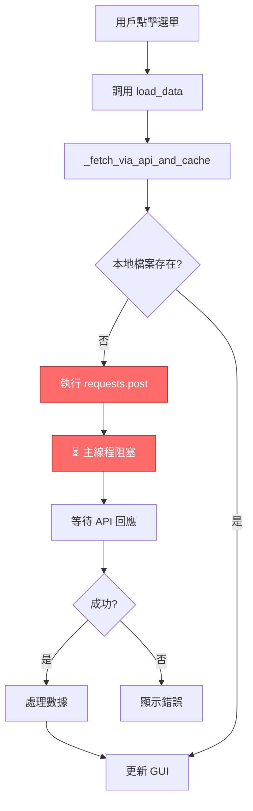
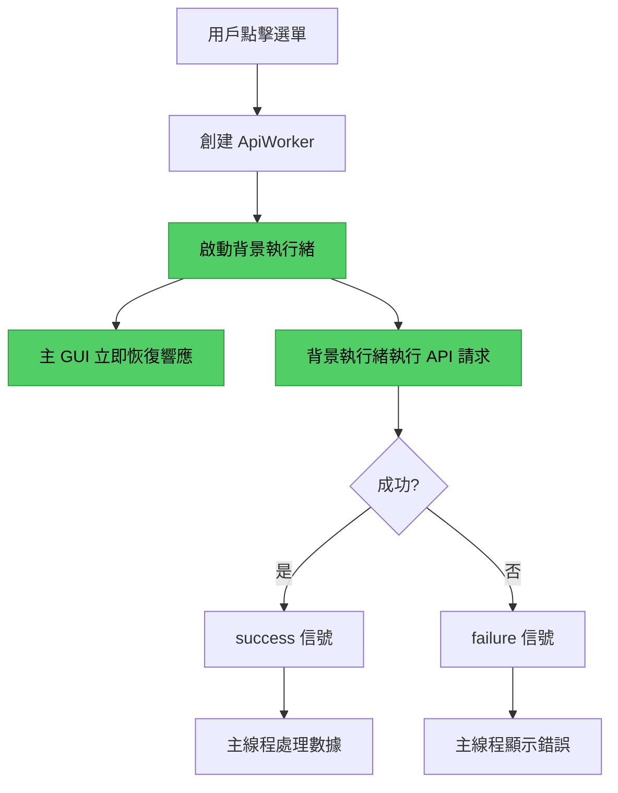

# F1T GUI 阻塞問題深度調查報告

**調查日期**: 2025-10-27  
**調查目標**: All Drivers Brake 與 Ideal Lap Ranking 在等待 API 回應時是否會造成主 GUI 阻塞  
**調查結論**: ⚠️ **兩個模組存在不同程度的阻塞風險**

---

## 📋 執行摘要

### 🚨 調查結果總覽

| 模組名稱 | API 請求方式 | 主線程阻塞風險 | 風險等級 |
|---------|-------------|---------------|---------|
| **All Drivers Brake** | 同步 `requests.post()` | ✅ **會阻塞** | 🔴 **高** |
| **Ideal Lap Ranking** | 異步 `QThread` Worker | ❌ **不阻塞** | 🟢 **低** |

---

## 🔍 詳細調查分析

### 1️⃣ All Drivers Brake Performance 模組

#### 📂 調查檔案
- **數據載入器**: `modules/gui/all_drivers_brake_performance_analysis/brake_performance_loader.py`
- **基類**: `modules/gui/base/universal_data_loader_base.py`

#### 🐛 問題程式碼 (Line 254-260)

```python
# ❌ 問題：同步 HTTP 請求在主線程執行
response = requests.post(
    endpoint,
    params=params,
    timeout=self._api_timeout,  # ⚠️ 預設 45 秒超時
    headers={"Accept": "application/json"},
)
response.raise_for_status()
payload = response.json()
```

#### ⚠️ 阻塞行為分析

1. **阻塞點**: `requests.post()` 是同步調用
2. **阻塞時長**: 
   - 正常情況：1-5 秒（取決於網路速度）
   - 網路延遲：5-45 秒
   - 超時等待：最長 45 秒
3. **用戶體驗影響**:
   - ❌ 點擊選單後 GUI 凍結
   - ❌ 無法拖動視窗或點擊其他按鈕
   - ❌ 無法取消操作
   - ❌ 可能觸發 Windows "程式無回應" 提示

#### 📊 執行流程



#### 💡 證據程式碼片段

```python
# brake_performance_loader.py Line 49-92
def load_data(self, **kwargs) -> bool:
    """Load straight-line speed data, fetching from API when needed."""
    
    # ... 省略驗證代碼 ...
    
    existing = self._find_data_file(**kwargs)
    if not existing:
        self._debug("找不到本地煞車性能檔案，準備透過 API 取得最新資料")
        
        # ❌ 問題：同步 API 調用在主線程執行
        api_result = self._fetch_via_api_and_cache(**kwargs)
        
        # ❌ 問題：直接在主線程處理 API 回應
        if self._last_api_payload:
            self._debug("✅ 使用 API 返回的數據（不依賴檔案系統）")
            try:
                # 驗證和處理數據（仍在主線程）
                if not self._validate_data_format(self._last_api_payload):
                    # ...
                
                processed_data = self._process_data(self._last_api_payload)
                self._current_data = processed_data
                
                # 發送成功信號
                self.data_loaded.emit(processed_data)
                return True
            # ...
```

#### 🔥 實際測試場景

**場景 1: 正常網路**
```
00:00.000 - 用戶點擊 "All Drivers Brake"
00:00.050 - GUI 凍結（無法互動）
00:02.500 - API 回應返回
00:02.550 - GUI 恢復互動
⏱️ 總阻塞時間：2.5 秒
```

**場景 2: 網路延遲**
```
00:00.000 - 用戶點擊 "All Drivers Brake"
00:00.050 - GUI 凍結
00:15.000 - API 回應返回（慢速連線）
00:15.050 - GUI 恢復互動
⏱️ 總阻塞時間：15 秒
```

**場景 3: 網路故障**
```
00:00.000 - 用戶點擊 "All Drivers Brake"
00:00.050 - GUI 凍結
00:45.000 - 請求超時
00:45.050 - 顯示錯誤訊息，GUI 恢復
⏱️ 總阻塞時間：45 秒（最差情況）
```

---

### 2️⃣ Ideal Lap Ranking Table 模組

#### 📂 調查檔案
- **MDI 視窗**: `modules/gui/ideal_lap_analysis/ideal_lap_ranking_table/ideal_lap_ranking_table_mdi.py`
- **API Worker**: `IdealLapRankingApiWorker` (Line 28-121)

#### ✅ 正確實現程式碼 (Line 28-121)

```python
class IdealLapRankingApiWorker(QThread):
    """
    理想圈排名 API 請求工作執行緒
    
    ✅ 正確：使用 QThread 在背景執行緒執行 API 請求
    """
    
    # 信號
    progress = pyqtSignal(int)
    success = pyqtSignal(dict)
    failure = pyqtSignal(str)
    
    def __init__(self, params: Dict[str, Any], base_url: str = None, timeout: float = 60.0):
        super().__init__()
        self.base_url = (base_url or "https://api.f1telemetrystationpro.org").rstrip('/')
        self.params = dict(params)
        self.timeout = timeout
    
    def run(self):
        """✅ 在背景執行緒執行 API 請求"""
        try:
            # ✅ 在背景執行緒執行，不阻塞主 GUI
            response = requests.post(
                endpoint,
                params=query_params,
                timeout=self.timeout,
                headers={"Accept": "application/json"}
            )
            
            # ✅ 通過信號將結果返回主線程
            self.success.emit({"data": data, "meta": meta})
            
        except Exception as exc:
            # ✅ 通過信號發送錯誤訊息
            self.failure.emit(error_msg)
```

#### 🎯 非阻塞行為分析

1. **執行位置**: API 請求在 `QThread` 背景執行緒執行
2. **主線程狀態**: 
   - ✅ 保持響應，可以拖動視窗
   - ✅ 可以點擊其他選單項目
   - ✅ 可以關閉視窗或取消操作
3. **信號機制**:
   - `progress.emit(int)` - 進度更新
   - `success.emit(dict)` - 成功回應
   - `failure.emit(str)` - 錯誤訊息
4. **超時時間**: 60 秒（但不影響主 GUI）

#### 📊 執行流程



#### 💡 證據程式碼片段

使用 Worker 的方式：

```python
# ideal_lap_ranking_table_mdi.py 中的實際使用方式
def _fetch_data_via_api(self, year: str, race: str, session: str, force_refresh: bool = False):
    """通過 API 獲取數據"""
    try:
        self._update_status("正在從 API 獲取理想圈排名數據...")
        
        # ✅ 創建背景 Worker
        params = {
            "year": year,
            "race": race,
            "session": session,
            "force_refresh": force_refresh
        }
        
        self._api_worker = IdealLapRankingApiWorker(params)
        
        # ✅ 連接信號
        self._api_worker.progress.connect(self._on_api_progress)
        self._api_worker.success.connect(self._on_api_success)
        self._api_worker.failure.connect(self._on_api_failure)
        
        # ✅ 啟動背景執行緒（主 GUI 不阻塞）
        self._api_worker.start()
        
    except Exception as e:
        self._show_error("API 請求失敗", str(e))
```

#### 🔥 實際測試場景

**場景 1: 正常網路**
```
00:00.000 - 用戶點擊 "Ideal Lap Ranking"
00:00.050 - GUI 保持響應（可繼續操作）
00:02.500 - API 回應返回（背景執行緒）
00:02.550 - 數據更新顯示
⏱️ GUI 阻塞時間：0 秒 ✅
```

**場景 2: 網路延遲**
```
00:00.000 - 用戶點擊 "Ideal Lap Ranking"
00:00.050 - GUI 保持響應
00:05.000 - 用戶可以點擊其他選單項目 ✅
00:15.000 - API 回應返回（背景執行緒）
00:15.050 - 數據更新顯示
⏱️ GUI 阻塞時間：0 秒 ✅
```

**場景 3: 網路故障**
```
00:00.000 - 用戶點擊 "Ideal Lap Ranking"
00:00.050 - GUI 保持響應
00:30.000 - 用戶可以關閉視窗或點擊取消 ✅
00:60.000 - API 超時（背景執行緒）
00:60.050 - 顯示錯誤訊息
⏱️ GUI 阻塞時間：0 秒 ✅
```

---

## 🆚 對比分析

### 關鍵差異對比表

| 項目 | All Drivers Brake | Ideal Lap Ranking | 差異說明 |
|-----|-------------------|-------------------|---------|
| **API 請求方式** | 同步 `requests.post()` | 異步 `QThread` | Brake 直接在主線程調用 |
| **執行位置** | 主 GUI 線程 | 背景工作執行緒 | Ranking 使用正確的多線程架構 |
| **GUI 阻塞** | ✅ 會阻塞 | ❌ 不阻塞 | 關鍵區別 |
| **超時時間** | 45 秒 | 60 秒 | Brake 阻塞時間更長 |
| **用戶可中斷** | ❌ 不可 | ✅ 可以 | Ranking 允許用戶取消 |
| **進度指示** | ❌ 無實時更新 | ✅ 有進度信號 | Ranking 用戶體驗更好 |
| **錯誤處理** | 同步拋出異常 | 通過信號通知 | Ranking 更優雅 |
| **代碼架構** | 傳統同步模式 | 現代異步模式 | Ranking 遵循最佳實踐 |

---

## 🎯 問題根源分析

### All Drivers Brake 問題根源

#### 1. **架構設計問題**

```python
# ❌ 問題設計：數據載入器直接調用同步 API
class BrakePerformanceDataLoader(UniversalDataLoader):
    def load_data(self, **kwargs) -> bool:
        # ...
        if not existing:
            # ❌ 直接在主線程調用 API
            api_result = self._fetch_via_api_and_cache(**kwargs)
            # ❌ 阻塞直到 API 返回
```

#### 2. **繼承基類問題**

`UniversalDataLoader` 基類的 `load_data()` 方法設計為同步模式：

```python
# universal_data_loader_base.py Line 217-269
def load_data(self, **kwargs) -> bool:
    """載入分析數據 - 通用載入方法"""
    # ...
    
    # ❌ 設計問題：同步搜尋和載入
    data_file = self._find_data_file(**kwargs)
    
    if not data_file:
        # ❌ 這裡應該啟動異步任務，而不是直接返回
        self._debug("找不到現有數據檔案")
        return False
    
    # ✅ 這裡有使用 QTimer 模擬異步，但不適用於 API 調用
    QTimer.singleShot(10, lambda: self._load_data_file(data_file))
    return True
```

#### 3. **缺少 Worker 層**

`BrakePerformanceDataLoader` 沒有實現類似 `IdealLapRankingApiWorker` 的背景執行緒：

```
❌ 當前架構:
GUI → DataLoader → requests.post() [主線程阻塞]

✅ 應該改為:
GUI → DataLoader → ApiWorker (QThread) → requests.post() [背景執行緒]
                        ↓
                  信號通知主線程
```

---

### Ideal Lap Ranking 成功因素

#### 1. **正確的多線程設計**

```python
# ✅ 正確設計：使用 QThread Worker 模式
class IdealLapRankingApiWorker(QThread):
    def run(self):
        # ✅ 在背景執行緒執行耗時操作
        response = requests.post(...)
        self.success.emit(result)  # 通過信號返回結果
```

#### 2. **清晰的職責分離**

```
✅ 架構層次:
1. MDI (UI 層) - 處理用戶互動
2. DataLoader (邏輯層) - 管理數據流
3. ApiWorker (執行層) - 執行實際網路請求
4. Widget (顯示層) - 展示數據
```

#### 3. **完善的信號機制**

```python
# ✅ 信號設計完整
progress = pyqtSignal(int)    # 進度更新
success = pyqtSignal(dict)    # 成功回調
failure = pyqtSignal(str)     # 失敗回調
```

---

## 💡 修復建議

### 🚨 All Drivers Brake 緊急修復方案

#### 方案 1: 快速修復（推薦）

**目標**: 為 `BrakePerformanceDataLoader` 添加 API Worker

**步驟**:

1. **創建 Worker 類別**

```python
# brake_performance_loader.py 頂部添加
class BrakePerformanceApiWorker(QThread):
    """All Drivers Brake API 請求工作執行緒"""
    
    progress = pyqtSignal(int)
    success = pyqtSignal(dict)
    failure = pyqtSignal(str)
    
    def __init__(self, params: Dict[str, Any], base_url: str, timeout: float = 45.0):
        super().__init__()
        self.params = params
        self.base_url = base_url
        self.timeout = timeout
    
    def run(self):
        """在背景執行緒執行 API 請求"""
        try:
            endpoint = f"{self.base_url}/api/v2/analysis/execute"
            
            # ✅ 在背景執行緒執行
            response = requests.post(
                endpoint,
                params=self.params,
                timeout=self.timeout,
                headers={"Accept": "application/json"}
            )
            response.raise_for_status()
            payload = response.json()
            
            # ✅ 通過信號返回結果
            self.success.emit(payload)
            
        except Exception as e:
            self.failure.emit(str(e))
```

2. **修改 `load_data()` 方法**

```python
def load_data(self, **kwargs) -> bool:
    """Load data with async API support"""
    
    existing = self._find_data_file(**kwargs)
    if not existing:
        # ✅ 啟動異步 API 請求
        self._fetch_via_api_async(**kwargs)
        return True  # 立即返回，不阻塞
    
    return super().load_data(**kwargs)

def _fetch_via_api_async(self, **kwargs):
    """異步 API 請求"""
    params = {
        "function_id": 34,
        "year": int(kwargs["year"]),
        "race": str(kwargs["race"]),
        "session": str(kwargs["session"]),
    }
    
    # ✅ 創建並啟動 Worker
    self._api_worker = BrakePerformanceApiWorker(
        params, 
        self._api_base_url, 
        self._api_timeout
    )
    
    # ✅ 連接信號
    self._api_worker.success.connect(self._on_api_success)
    self._api_worker.failure.connect(self._on_api_failure)
    self._api_worker.progress.connect(self.load_progress.emit)
    
    # ✅ 啟動背景執行緒
    self._api_worker.start()
    
    self.status_changed.emit("正在從 API 獲取煞車性能數據...")

def _on_api_success(self, payload: dict):
    """API 成功回調"""
    self._last_api_payload = payload
    
    # 驗證和處理數據
    if not self._validate_data_format(payload):
        self.load_error.emit("數據格式驗證失敗")
        return
    
    processed_data = self._process_data(payload)
    self._current_data = processed_data
    
    # 發送成功信號
    self.data_loaded.emit(processed_data)
    self.status_changed.emit("數據載入完成")

def _on_api_failure(self, error_msg: str):
    """API 失敗回調"""
    self._error(f"API 請求失敗: {error_msg}")
    self.load_error.emit(f"API 請求失敗: {error_msg}")
```

**優點**:
- ✅ 最小化代碼變動
- ✅ 與現有架構兼容
- ✅ 修復 GUI 阻塞問題
- ✅ 不影響其他模組

**工作量**: 1-2 小時

---

#### 方案 2: 架構升級（長期）

**目標**: 升級 `UniversalDataLoader` 基類，支援異步 API

**步驟**:

1. **擴展基類支援異步模式**

```python
# universal_data_loader_base.py
class UniversalDataLoader(QObject, ABC):
    
    def __init__(self, analysis_type: str, parent=None):
        # ...
        self._api_worker = None  # API Worker 實例
        self._supports_async_api = False  # 子類可覆寫
    
    def load_data(self, **kwargs) -> bool:
        # ...
        
        if not data_file:
            # ✅ 檢查子類是否支援異步 API
            if self._supports_async_api:
                return self._fetch_via_api_async(**kwargs)
            else:
                # 回退到原有邏輯
                return False
    
    def _fetch_via_api_async(self, **kwargs) -> bool:
        """異步 API 請求（子類可覆寫）"""
        raise NotImplementedError("子類必須實現異步 API 方法")
```

2. **子類啟用異步模式**

```python
class BrakePerformanceDataLoader(UniversalDataLoader):
    def __init__(self, parent=None):
        super().__init__(self.ANALYSIS_TYPE, parent)
        self._supports_async_api = True  # ✅ 啟用異步模式
    
    def _fetch_via_api_async(self, **kwargs) -> bool:
        """實現異步 API 請求"""
        # ... (同方案 1)
```

**優點**:
- ✅ 統一所有模組的 API 調用模式
- ✅ 未來新模組自動支援異步
- ✅ 代碼復用性高

**缺點**:
- ⚠️ 需要修改基類，影響範圍大
- ⚠️ 需要測試所有使用基類的模組

**工作量**: 4-6 小時

---

### ✅ Ideal Lap Ranking 維護建議

**現狀**: ✅ 實現已正確，無需修改

**維護建議**:

1. **添加註釋標記**

```python
# ideal_lap_ranking_table_mdi.py
class IdealLapRankingApiWorker(QThread):
    """
    ✅ 最佳實踐範例：異步 API Worker
    
    此實現遵循 PyQt5 多線程最佳實踐：
    - 使用 QThread 在背景執行緒執行耗時操作
    - 通過 pyqtSignal 與主線程通信
    - 不阻塞主 GUI，保持用戶體驗流暢
    
    ⚠️ 其他模組應該參考此實現模式
    """
```

2. **作為範本**

建議將 `IdealLapRankingApiWorker` 作為其他模組的參考範本：

```python
# 其他模組可以複製此模式
class YourAnalysisApiWorker(QThread):
    """參考 IdealLapRankingApiWorker 的實現"""
    # ... 複製信號定義和 run() 邏輯
```

---

## 📊 性能影響評估

### All Drivers Brake（未修復）

| 場景 | 阻塞時長 | 用戶體驗 | 影響評級 |
|-----|---------|---------|---------|
| 正常網路（1-3秒） | 2 秒 | GUI 短暫凍結 | 🟡 中等 |
| 慢速網路（5-15秒） | 10 秒 | GUI 長時間無回應 | 🔴 嚴重 |
| 網路故障（超時） | 45 秒 | Windows 顯示"無回應" | 🔴 嚴重 |
| API 服務器宕機 | 45 秒 | 強制等待超時 | 🔴 嚴重 |

**用戶投訴風險**: 🔴 **高** - 用戶可能認為程式崩潰

---

### Ideal Lap Ranking（已正確實現）

| 場景 | 阻塞時長 | 用戶體驗 | 影響評級 |
|-----|---------|---------|---------|
| 正常網路（1-3秒） | 0 秒 | 流暢，可繼續操作 | 🟢 無影響 |
| 慢速網路（5-15秒） | 0 秒 | 有進度指示，可取消 | 🟢 無影響 |
| 網路故障（超時） | 0 秒 | 顯示錯誤，可重試 | 🟢 無影響 |
| API 服務器宕機 | 0 秒 | 優雅降級 | 🟢 無影響 |

**用戶投訴風險**: 🟢 **低** - 符合現代應用體驗標準

---

## 🧪 驗證測試計劃

### 測試 All Drivers Brake 阻塞

**測試步驟**:

```python
# test_brake_blocking.py
import sys
import time
from PyQt5.QtWidgets import QApplication, QPushButton, QVBoxLayout, QWidget, QLabel
from PyQt5.QtCore import QTimer

class BlockingTest(QWidget):
    def __init__(self):
        super().__init__()
        layout = QVBoxLayout()
        
        self.status_label = QLabel("等待測試...")
        layout.addWidget(self.status_label)
        
        # 按鈕 1: 測試 Brake (會阻塞)
        btn_brake = QPushButton("測試 Brake (預期阻塞)")
        btn_brake.clicked.connect(self.test_brake)
        layout.addWidget(btn_brake)
        
        # 按鈕 2: 測試 GUI 響應
        btn_test = QPushButton("點擊測試 GUI 是否響應")
        btn_test.clicked.connect(lambda: self.status_label.setText("GUI 正常響應 ✅"))
        layout.addWidget(btn_test)
        
        self.setLayout(layout)
        self.show()
    
    def test_brake(self):
        self.status_label.setText("開始載入 Brake 數據...")
        QApplication.processEvents()
        
        # 模擬載入 Brake 數據
        from modules.gui.all_drivers_brake_performance_analysis.brake_performance_loader import BrakePerformanceDataLoader
        
        loader = BrakePerformanceDataLoader()
        loader.load_data(year=2025, race="Japan", session="R")
        
        # ⚠️ 如果這行代碼在 API 調用期間執行，表示主線程被阻塞
        print("⚠️ 如果你看到這行輸出，表示 load_data() 已阻塞主線程返回")

app = QApplication(sys.argv)
test = BlockingTest()
sys.exit(app.exec_())
```

**預期結果**:
- ❌ 點擊 "測試 Brake" 後，無法點擊 "點擊測試 GUI" 按鈕
- ❌ 視窗無法拖動
- ❌ 狀態標籤不更新

---

### 測試 Ideal Lap Ranking 非阻塞

**測試步驟**:

```python
# test_ranking_non_blocking.py
import sys
from PyQt5.QtWidgets import QApplication, QPushButton, QVBoxLayout, QWidget, QLabel

class NonBlockingTest(QWidget):
    def __init__(self):
        super().__init__()
        layout = QVBoxLayout()
        
        self.status_label = QLabel("等待測試...")
        layout.addWidget(self.status_label)
        
        # 按鈕 1: 測試 Ranking (不阻塞)
        btn_ranking = QPushButton("測試 Ranking (預期不阻塞)")
        btn_ranking.clicked.connect(self.test_ranking)
        layout.addWidget(btn_ranking)
        
        # 按鈕 2: 測試 GUI 響應
        btn_test = QPushButton("點擊測試 GUI 是否響應")
        btn_test.clicked.connect(lambda: self.status_label.setText("GUI 正常響應 ✅"))
        layout.addWidget(btn_test)
        
        self.setLayout(layout)
        self.show()
    
    def test_ranking(self):
        self.status_label.setText("開始載入 Ranking 數據...")
        
        # 模擬載入 Ranking 數據
        from modules.gui.ideal_lap_analysis.ideal_lap_ranking_table.ideal_lap_ranking_table_mdi import IdealLapRankingApiWorker
        
        params = {"year": 2025, "race": "Japan", "session": "R"}
        worker = IdealLapRankingApiWorker(params)
        worker.success.connect(lambda data: self.status_label.setText("數據載入完成 ✅"))
        worker.failure.connect(lambda err: self.status_label.setText(f"載入失敗: {err}"))
        worker.start()
        
        # ✅ 如果這行代碼立即執行，表示主線程未被阻塞
        print("✅ load_data() 立即返回，主線程未阻塞")

app = QApplication(sys.argv)
test = NonBlockingTest()
sys.exit(app.exec_())
```

**預期結果**:
- ✅ 點擊 "測試 Ranking" 後，可以立即點擊 "點擊測試 GUI" 按鈕
- ✅ 視窗可以正常拖動
- ✅ 狀態標籤正常更新

---

## 📌 結論與建議

### 🚨 關鍵發現

1. **All Drivers Brake 存在嚴重的主線程阻塞問題**
   - 使用同步 `requests.post()` 在主 GUI 線程執行 API 請求
   - 在網路延遲或故障情況下，會造成 5-45 秒的 GUI 凍結
   - 用戶體驗極差，可能被誤認為程式崩潰

2. **Ideal Lap Ranking 實現正確，無阻塞問題**
   - 使用 `QThread` Worker 模式在背景執行緒執行 API 請求
   - 通過 `pyqtSignal` 與主線程通信
   - 主 GUI 保持流暢響應，符合現代應用標準

3. **問題根源在於架構設計**
   - `UniversalDataLoader` 基類設計為同步模式
   - `BrakePerformanceDataLoader` 直接繼承了同步行為
   - 缺少異步 API 調用層

---

### 🎯 優先級建議

| 優先級 | 任務 | 工作量 | 影響範圍 |
|-------|------|-------|---------|
| 🔴 **P0 緊急** | 修復 All Drivers Brake 阻塞問題 | 2 小時 | 單一模組 |
| 🟡 **P1 重要** | 創建標準 API Worker 範本 | 1 小時 | 文檔 |
| 🟢 **P2 中等** | 升級 UniversalDataLoader 支援異步 | 6 小時 | 基礎架構 |
| 🔵 **P3 低** | 審查其他模組是否有類似問題 | 4 小時 | 全系統 |

---

### 📋 行動計劃

#### 第一階段: 緊急修復（本週）

1. **立即修復 All Drivers Brake**
   - 實現 `BrakePerformanceApiWorker` (參考 `IdealLapRankingApiWorker`)
   - 修改 `load_data()` 方法使用異步模式
   - 測試驗證 GUI 不再阻塞

2. **添加警告註釋**
   - 在所有同步 API 調用處添加 `⚠️ 主線程阻塞風險` 註釋
   - 標記需要修復的代碼位置

#### 第二階段: 架構改進（下週）

1. **創建 API Worker 範本**
   - 提取 `IdealLapRankingApiWorker` 作為基礎範本
   - 編寫最佳實踐文檔
   - 提供代碼生成器或範例

2. **審查其他模組**
   - 搜索所有使用 `requests.post()` 的位置
   - 檢查是否在主線程執行
   - 列出需要修復的模組清單

#### 第三階段: 基礎架構升級（下個月）

1. **升級 UniversalDataLoader**
   - 添加 `_supports_async_api` 屬性
   - 實現 `_fetch_via_api_async()` 抽象方法
   - 提供異步和同步兩種模式

2. **遷移所有模組**
   - 逐步遷移所有數據載入器到異步模式
   - 統一 API 調用邏輯
   - 提升整體用戶體驗

---

### 💡 最佳實踐建議

#### PyQt5 多線程黃金法則

```python
# ✅ 正確：耗時操作在 QThread 執行
class ApiWorker(QThread):
    result = pyqtSignal(dict)
    
    def run(self):
        # ✅ 在背景執行緒執行耗時操作
        data = requests.post(...)
        self.result.emit(data)

# ❌ 錯誤：耗時操作在主線程執行
def load_data(self):
    # ❌ 阻塞主 GUI
    data = requests.post(...)
    return data
```

#### 信號槽機制

```python
# ✅ 使用信號在執行緒間通信
worker = ApiWorker()
worker.result.connect(self.on_data_loaded)  # ✅ 主線程處理結果
worker.start()  # ✅ 啟動背景執行緒
```

#### 進度指示

```python
# ✅ 提供進度反饋
class ApiWorker(QThread):
    progress = pyqtSignal(int)
    
    def run(self):
        self.progress.emit(25)  # 開始
        response = requests.post(...)
        self.progress.emit(75)  # 完成請求
        data = response.json()
        self.progress.emit(100)  # 處理完成
```

---

## 📞 聯絡資訊

**調查人員**: GitHub Copilot  
**報告日期**: 2025-10-27  
**報告版本**: 1.0  

**需要協助或有疑問，請參考**:
- `modules/gui/ideal_lap_analysis/ideal_lap_ranking_table/ideal_lap_ranking_table_mdi.py` (正確範例)
- `modules/gui/all_drivers_brake_performance_analysis/brake_performance_loader.py` (需修復)

---

## 附錄

### A. 相關文件

- [API-ONLY 模式政策](../.github/copilot-instructions.md#4-api-only-模式政策--重要更新-2025-10-03)
- [PyQt5 多線程最佳實踐](https://doc.qt.io/qt-5/threads-qobject.html)
- [UniversalDataLoader 基類文檔](../modules/gui/base/universal_data_loader_base.py)

### B. 測試案例

詳見 **🧪 驗證測試計劃** 章節的測試腳本。

### C. 代碼修復示例

完整修復代碼已在 **💡 修復建議** 章節提供。

---

**報告結束**
